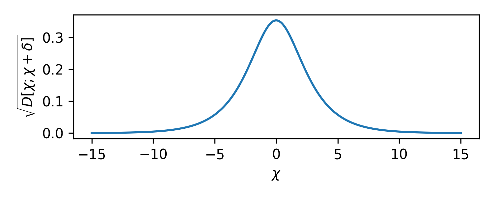

<link href="https://fonts.googleapis.com/css2?family=Merriweather:ital,wght@0,300;0,400;1,300&amp;display=swap" rel="stylesheet">
<style>
    svg { font-family: Merriweather; }
</style>
<script type="module" src="./assets/Meter.js"></script>

With the election coming up, I found myself thinking about the old [NYTimes Needle](https://www.nytimes.com/2024/03/05/us/elections/super-tuesday-needle.html) and more generally about how to represent and communicate probabilities.<sup><a href="#kaytalk">xxa-kaytalk</a></sup>

<aside><sup id="kaytalk">xxa-kaytalk</sup> 
 For a fantastic overview, see Matthew Kay's talk: <a href="https://youtu.be/E1kSnWvqCw0?si=8oi5U6eAmjROWXdx">A biased tour of the uncertainty visualization zoo</a>.
</aside>

We already have many different ways to discuss degrees of belief: <a href="https://en.wikipedia.org/wiki/Probability">probabilties</a>, <a href="https://en.wikipedia.org/wiki/Percentage">percents</a>,<sup><a href="#percent">xxa-percent</a></sup> <a href="https://en.wikipedia.org/wiki/Odds">odds</a>, <a href="https://en.wikipedia.org/wiki/Logit">log-odds</a>, <a href="https://en.wikipedia.org/wiki/Nat_(unit)">nats</a>, <a href="https://en.wikipedia.org/wiki/Bit">bits</a>, or <a href="https://en.wikipedia.org/wiki/Hartley_(unit)">decibans</a>...  Why don't we add another to the mix.  What if we measure degrees of belief in... degrees.

<aside><sup id="percent">xxa-percent</sup> 
 Not to mention <a href="https://en.wikipedia.org/wiki/Per_mille">per mille (‰)</a>, <a href="https://en.wikipedia.org/wiki/Basis_point#Permyriad">permyriad (‱)</a>, <a href="https://en.wikipedia.org/wiki/Per_cent_mille">per cent mille (pcm)</a>, <a href="https://en.wikipedia.org/wiki/Parts-per_notation">parts per million (ppm)</a>, parts per billion (ppb), etc...
</aside>

Specifically, let's use the following transformation:
$$ \theta = \arccos \sqrt p,  \qquad p = \cos^2 \theta .$$


<figure id="scale" class="right">
  <center>
  
  <figcaption>
  Figure xxf-scale. A visual representation of the mapping.
  </figcaption>
  </center>
</figure>

This maps the probabilities between 0 and 1 to angles between 0 and 90 degrees, in a nonlinear way.  0 degrees, or full alignment corresponds to a 100% probability, while a 90 degree angle, or *orthogonal* one corresponds to impossibility.

While this might seem unnatural, it is likely the best way to present and talk about probabilities.

## Uniformity

What gives? Why the nonlinear mapping?  This particular mapping happens to be statistically *uniform* in an interesting way.

We are all well aware that not all 1% changes in probability mean the same thing. We intuitively believe there is a much smaller difference between 50% and 51% as there is between 98% and 99%.  Why is that?  

As we've discussed [before](kl.html), the only proper way to compare two probability distributions is the KL divergence, let's look at the KL divergence between two Bernoulli distributions with probabilities $p$ and $p + \delta$:

$$ D[p; p+\delta] \equiv p \log \frac{p}{p+\delta} + (1-p) \log \frac{1-p}{1-p-\delta} \approx -\frac{\delta^2}{2 p (1-p)} + \cdots. $$

To leading order, this is quadratic in the change $\delta$ and depends inversely on the probability $p$ and its complement $1-p$.  If we interpret this as a kind of squared distance, the square root of this gives us the usual [Jeffrey's prior](https://en.wikipedia.org/wiki/Jeffreys_prior) for the Bernoulli problem:

$$ p(p) = \frac{1}{\pi \sqrt{p (1-p)} }. $$

<figure id="jeffreys">
  <center>
  
  <figcaption>
  Figure xxf-jeffreys. Unit infinitestimal changes in the probability have different statistical effects.  They are emphasized near the extremes, fairly extremely.
  </figcaption>
  </center>
</figure>


Here we can clearly see that as we reach the extreme values of the probability $p$, the statistical distance blows up.  Going from $0.99$ to $0.991$ is 26 times larger a change in terms of KL than going from $0.50$ to $0.501$.  Clearly, probabilities are not very uniform.

If we took as our prior the distribution $1/\pi\sqrt{p(1-p)}$ we would be weighing the probabilties proportional to this statistical distance. I.e. we would be putting equal weight on equally *distinguishable* probabilities.

What if we tried to work in terms of log-odds?  Here if we transform into log-odds:

$$ \chi = \log \frac{p}{1-p}, $$

We get KL divergences that take the form:

$$ D[\chi; \chi+\delta] \approx \frac{\delta^2}{4 + 4 \cosh \chi} + \cdots, $$

which has the opposite problem as seen below.

<figure id="logits">
  <center>
  
  <figcaption>
  Figure xxf-logits. Unit infinitestimal changes in logits have different statistical effects.  They are emphasized near the middle.
  </figcaption>
  </center>
</figure>

<aside><sup id="jeffrey-logit">xxa-jeffreylogit</sup> 
 Coincidentally, though its not often discussed, this is the form that Jeffrey's prior takes when expressed in terms of log-odds. $1/\sqrt{4 + 4 \cosh \chi}$.
</aside>

Now, moving from $0.00$ to $0.01$ in log-odds, is 42 times as large an effect as going from $5.00$ to $5.01$ in log-odds.<sup><a href="#jeffrey-logit">xxa-jeffreylogit</a></sup>

<aside><sup id="alternate-jeffreys">xxa-alternatejeffreys</sup> 
 Equivalently, the question becomes, is there a paramaterization for which Jeffrey's prior is uniform.  Honestly, in writing this post it occurred to me that this might actually be a better way to motivate Jeffrey's prior in the first place, though I don't think this is how its normally done.
</aside>

The question then becomes: *Is there a parameterization of degrees of belief for which the statistical metric is flat?*<sup><a href="#alternate-jeffreys">xxa-alternatejeffreys</a></sup>

To transform a density but have it have a consistent meaning, we require that:

$$ p(p)\, \mathrm{d}p = p(\theta)\, \mathrm{d}\theta, $$

substituting the two densities we know, we want to solve:

$$ \frac{\mathrm{d}p}{\pi \sqrt{p(1-p)}} = \mathrm{d}\theta . $$

The solution takes the form (up to proportionality):

$$ \theta = \arccos \sqrt p, \qquad p = \cos^2 \theta . $$ 

This is the mapping we opened the post with.  In this parameterization, we have that the KL divergence is *flat*:

$$ D[\theta; \theta + \delta] \approx 2\delta^2  + \cdots . $$


It is in this parameterization that a small change in the parameter means the same thing at every value of the parameter.  This parameterization is *uniform* in a deep sense.  Jeffrey's prior, expressed in this $\theta$ parameter is uniform.

<figure id="thetas">
  <center>
  
  <figcaption>
  Figure xxf-thetas. Unit infinitestimal changes in angles have uniform statistical effects.  
  </figcaption>
  </center>
</figure>

<aside><sup id="quantum">xxa-quantum</sup> 
 Bengtsson, Ingemar, and Karol Życzkowski. <a href="https://www.google.com/books/edition/_/sYswDwAAQBAJ?hl=en&gbpv=0">Geometry of quantum states: an introduction to quantum entanglement</a>. Cambridge university press, 2017.
</aside>

<aside><sup id="quinn">xxa-quinn</sup>
Quinn, Katherine N, et al. “Visualizing Probabilistic Models and Data with Intensive Principal Component Analysis.” Proceedings of the National Academy of Sciences, vol. 116, no. 28, 24 June 2019, pp. 13762–13767, <a href="https://arxiv.org/abs/1810.02877">arxiv.org/abs/1810.02877</a>, <a href="https://doi.org/10.1073/pnas.1817218116">10.1073/pnas.1817218116</a>. Accessed 23 Oct. 2024.
</aside>


It turns out that this angular distance is related to the <a href="https://en.wikipedia.org/wiki/Bhattacharyya_distance">Bhattacharyya distance</a>.
If we take the straight line chordal distance between the two distributions on this arc, it turns out to be equivalent to the <a href="https://en.wikipedia.org/wiki/Hellinger_distance">Hellinger distance</a>.<sup><a href="#quantum">xxa-quantum</a>,<a href="#quinn">xxa-quinn</a></sup>


<aside><sup id="leading">xxa-leading</sup> 
 Technically, the KL divergence is only uniform to <i>leading order</i>.  There are higher order corrections that show up and which are most extreme at the edges of the space. 
</aside>


This is, in some sense, the most natural parameterizations of probabilities.  In terms of ordinary probabilities, the space is curved, the metric isn't flat, the world is distorted as we move around the space.  In terms of these *degrees* ($\theta$), the metric is flat.  A 1 degree change means the same thing, statistically, regardless of where we start.<a href="#leading"><sup>xxa-leading</sup></a>  The full range of possibilities range from 0° to 90°, which we can visualize as a quarter circle, turned on its side to resemble a meter.

<probability-meter id="interactive" probability="0.53"></probability-meter>


<div class="controls">
        <input type="range" id="probabilitySlider" min="0" max="1" step="0.0001" value="0.53">
        <input type="number" id="probabilityInput" min="0" max="1" step="0.0001" value="0.53">
</div>

A probability of <span id="probVal">53</span>% corresponds to an angle of <span id="angVal">43.28</span>°.

This meter is interactive, you can adjust the probability with the slider or input box.


## Relativity

Having identified this mathematically elegant parameterization of degrees of belief, the question remains: is it practical for everyday use?

Well, the more I think about it, the more I think this might actually be a decent idea.  People already are familiar with
angles and degrees.  We have a sense of how large 1° is, or 5° or 30°.  We can visualize where these would fall on the meter.

Another benefit of angles is that we already have a strong sense that they are relative.  We could easily switch whether we consider 0° to correspond 
to complete certainty: 

<probability-meter id="off-one" probability="1.0" 
    labels='{"angles": [15, 30, 45, 60, 75], "labels": ["15°", "30°", "45°", "60°", "75°"]}'>
</probability-meter>

or whether we wanted to measure angles relative to the middle, relative to a toss up:
<probability-meter id="off-middle" probability="0.5"
    labels='{"angles": [15, 30, 45, 60, 75], "labels": ["+30°", "+15°", "0°", "-15°", "-30°"]}'>
</probability-meter>

<aside><sup id="leading">xxa-election</sup> 
 I just refreshed <a href="https://www.economist.com/interactive/us-2024-election/prediction-model/president">the economist</a> model and it has 56-44 in favor of Trump.
</aside>

For instance, we might want to describe the upcoming election.  We could associate one end of the meter
with Donald Trump winning the election and one end with Kamala Harris, and summarize [the economist](https://www.economist.com/interactive/us-2024-election/prediction-model/president) model of the election as being tilted 3.45° towards Trump, today.<a href="#economist"><sup>xxa-election</sup></a>

<probability-meter probability="0.56" 
    labels='{"angles": [10, 80], "labels": ["Trump", "Harris"]}'>
</probability-meter>


We could just as easily measure angles with respect to impossibility in the case of rare events:
<probability-meter id="off-zero" probability="0.0"
    labels='{"angles": [15, 30, 45, 60, 75], "labels": ["75°", "60°", "45°", "30°", "15°"]}'>
</probability-meter>

For instance, we might say there is a 19° chance of rain today:
<probability-meter probability="0.10"
    labels='{"angles": [10, 80], "labels": ["Rain", "No Rain"]}'>
</probability-meter>


## Kent's Words of Estimative Probability

In the meters on this page, as a visual aid, I've colored bands of 15° increments.  It turns out that these perfectly line up with [Kent's words of Estimative Probability](https://en.wikipedia.org/wiki/Words_of_estimative_probability), suggesting that human perceptions of probabilities might actually be better aligned with this scale.  More thoughts on human perception below in <a href="#app-perception">Appendix A</a>

<figure id="kent">
  <center>
  
  <figcaption>
  Figure xxf-kent. Kent's words of estimative probability line up perfectly on the degree scale.
  </figcaption>
  </center>
</figure>


## Approximate Calculation

While this mapping seems interesting, no one can compute $\arccos \sqrt p$ in their head.  Fortunately, as we show below in <a href="#app-taylor">Appendix A</a>, near the middle the map is linear and near the edges it looks like a square root, so if we want an accurate and easy to calculate on pencil and paper version of the mapping, we can split our probabilities into three regions, 
dividing the probability space into three regions: below 0.25, between 0.25 and 0.75, and above 0.75.

Since we have that $180/\pi \approx 60$ if we want to estimate the degrees for a given probability in our head we can use:
$$ \Delta\theta(p) \sim 60 \Delta p, $$
for $p$ values near $\frac 12$ and for values near the extremes we can use:
    $$ \Delta\theta(p) \sim 60 \sqrt{\Delta p}. $$

If you need a good way to mentally calculate a square root, take a guess $g$ and then average $p$ and $p/g$.  You can repeat this many times to get as much accuracy as you desire.<sup><a href="#cook">xxa-cook</a></sup>

<aside><sup id="cook">xxa-cook</sup> 
    This is the <a href="https://en.wikipedia.org/wiki/Methods_of_computing_square_roots#Heron's_method">Babylonian method</a>, aka an application of <a href="https://en.wikipedia.org/wiki/Newton%27s_method#Examples">Newton's root finding method</a>.
    For this and a whole slew of useful mental arithmetic tips, see <a href="https://www.johndcook.com/blog/mental-functions/">John D. Cook's Blog, The Endeavor</a>. 
</aside>

This simple to compute approximate mapping turns out to be very accurate.  It is good to less than half a degree over the whole range as shown below in Figure xxf-error.

<figure id="approx-error">
  <center>
  
  <figcaption>
  Figure xxf-error. Errors in the Approximate mapping.
  </figcaption>
  </center>
</figure>

As long as we are alright with reporting relative angles, this creates a very simple mapping.  For example, before we said the economist model had Trump's probability of winning at 56%, to estimate this in degrees we take $60 \times 0.06$ to get 3.6°, compared with the more exact 3.45°. If we think there is a 5% chance of rain, we say that that is $60 \times \sqrt{0.10} = 60 \times \sqrt 10 / 10 \approx 19^\circ$, compared with the more exat 18.43°.  This method is very practical and very accurate.

## Conclusion

Maybe we should discuss degrees of belief in degrees.  This creates a very intuitive visual representation for probabilities, and one that is statistically uniform in an interesting an useful way.  It isn't all that hard to compute, especially if we are alright with a half degree accuracy as in the previous section.  With a little bit of time, I think we could come to intuit what a 1° or 5° or 10° or 30° shift in probabilities *felt* like, and unlike with either probabilities or odds, that useful internal sense would work well for us regardless of the baseline rate.  A 5° away from center would *mean* the same sort of thing as a 5° away from certainty.

Give a shot.  In <a href="#app-widget">Appendix C</a> I've made available the code for the widgets that appear on this page, which should make it easy for anyone to try.


# Appendix A - Taylor Expansions
<p id="app-taylor">
If we Taylor expand this map near $p=1/2$, the map is approximately linear:
$$ \theta(p) \approx \frac{\pi}{4} - \left( p - \frac 12 \right) - \frac 23 \left( p - \frac 12 \right)^3 + \cdots . $$
</p>

Near $p=0$ its square root like:
$$ \theta(p) \approx \frac{\pi}{2} - \sqrt p - \frac{p^{\frac 3 2}}{6} - \cdots . $$
And similarly near $p=1$: 
$$ \theta(p) \approx \sqrt{1-p} + \frac{(1-p)^{\frac 3 2}}{6} + \cdots. $$


# Appendix B - Categorical Generalization

This idea easily extends to Categorical distributions, where the flat statistical manifold corresponds to the positive octant of the n-sphere as discussed in Bengtsson et al.<a href=#quantum2"><sup>xxa-quantum2</sup></a>

<aside><sup id="quantum2">xxa-quantum2</sup> 
 Bengtsson, Ingemar, and Karol Życzkowski. <a href="https://www.google.com/books/edition/_/sYswDwAAQBAJ?hl=en&gbpv=0">Geometry of quantum states: an introduction to quantum entanglement</a>. Cambridge university press, 2017.
</aside>

<span id="app-widget"></span>
## Appendix C - Widget

I created a WebComponents element, so that you can simply add the [script]("https://blog.alexalemi.com/assets/Meter.js") as a module to your page:

```html
<script type="module" src="https://blog.alexalemi.com/assets/Meter.js"></script>
```

in your `<head>` section and later insert:

```html
<probability-meter probability="0.53"></probability-meter>
```

elements to your page and it will render as:

<probability-meter id="appendix" probability="0.53"></probability-meter>

<span id="app-perception"></span>
# Appendix D - Human Perception

<aside><sup id="good">xxa-good</sup> 
Good, I. J. "Weight of evidence: A brief survey." Bayesian statistics 2 (1985): 249-270. <a href="https://www.cs.tufts.edu/comp/150FP/archive/jack-good/weight-of-evidence.pdf">[pdf]</a>
</aside>

<aside><sup id="jaynes">xxa-jaynes</sup> 
Jaynes, Edwin T. Probability theory: The logic of science. Cambridge university press, 2003. <a href="http://www-biba.inrialpes.fr/Jaynes/prob.html">[link]</a>
</aside>

It is generally claimed that human perception aligns well with log-odds.  Good<a href="#good"><sup>xxa-good</sup></a> and Jaynes<a href="#jaynes"><sup>xxa-jaynes</sup></a> both advocated the use of *[decibans](https://en.wikipedia.org/wiki/Hartley_(unit))*. These work great for accumulating evidence and doing bayesian updates.

<aside><sup id="ubiquitous">xxa-ubiquitous</sup> 
Zhang, Hang, and Laurence T. Maloney. "Ubiquitous log odds: a common representation of probability and frequency distortion in perception, action, and cognition." Frontiers in neuroscience 6 (2012): 1. <a href="https://www.frontiersin.org/journals/neuroscience/articles/10.3389/fnins.2012.00001/full">[link]</a>
</aside>

In the field of human perception, I've often seen references to Zhang et al.<a href="#ubiquitous"><sup>xxa-ubiquitous</sup></a> to justify the claim that human perception is well aligned with log-odds.  In the paper they collected a bunch of human perceptual studies and show that you can use a mapping that is linear in log odds to explain the data.  For example, here is Figure 1 from the paper:

<figure>
  <center>
  
  <figcaption>
  Figure xxf-ubiquitous. Figure 1 from Zhang et al. showing the linear in log-odds fit to the perceptual data.
  </figcaption>
  </center>
</figure>

Here, the blue lines show fits of a two parameter function:

$$ \textsf{Lo}(\pi) = \gamma \textsf{Lo}(p) + (1-\gamma) \textsf{Lo}(p_0), $$

which describes a linear map acting on the log odds of the true probability and some baseline probability to describe the log-odds of the perceptual probability.  The paper considers it a success that they can use the simple two parameter function to get a mapping that shows good agreement with the experimental data.

You know what these curves look like? They look like our arcsine transformation.  Without any parameters, here is a plot of:

$$ \arcsin \sqrt p. $$

This is the same as our proposed mapping (just with the opposite sign).


<figure>
  <center>
  
  <figcaption>
  Figure xxf-arcsine. Arcsine transformation over the same sort of ranges as in the Figure above.
  </figcaption>
  </center>
</figure>

Look's pretty good to me.


# Appendix E - ArcSin Transformation

It seems as though there is a history of using the "arcsin" transformation to transform probabilites for statistical models.  It seems like this was more popular before the logistic model took off. 

I found several references in this direction:

 * Double arcsin transform not appropriate for meta-analysis. Röver and Friede. [arXiv:2203.04773](https://arxiv.org/abs/2203.04773)
 * The arcsine is asinine: the analysis of proportions in ecology. Warton and Hui. *Ecology* 92(1), 2011, pp. 3-10. [[link]](https://esajournals.onlinelibrary.wiley.com/doi/pdf/10.1890/10-0340.1)
 * The Square Root Transformation in Analysis of Variance. Bartlett. *Supplement to the Journal of the Royal Statistical Society*. Vol 3. No 1. 1936. [[link]](https://www.jstor.org/stable/2983678)
 * Transformations Related to the Angular and the Square Root. Freeman and Tukey. *Ann. Math Statist.* 21(4): 607-611 (1950). [[link]](https://projecteuclid.org/journals/annals-of-mathematical-statistics/volume-21/issue-4/Transformations-Related-to-the-Angular-and-the-Square-Root/10.1214/aoms/1177729756.full)

Many of the references are critical of the "arcsine" transformation, and I would tend to agree.  For something like a logistic regression model, if you map the probabilities to a fixed interval, you're going to have difficulty interpreting the coefficients of your effects.  My understanding is that people were using this arcsine transformation and then fitting models of the form:

$$ \theta \sim X \beta,  $$ 

for some observations $X$, learning some coefficients $\beta$, but since $\theta$ is bounded, these models naturally make unphysical predictions if you extrapolate them.  The logistic model doesn't have the same problem, since log-odds are unbounded.

While I agree that measuring degrees of belief in degrees doesn't work great for linear models, I still think it would work well for talking about and communicating probabilites.

# Appendix F - Connection to Quantum Mechanics

The final connection I want to point out is easier to see if we recast the Bernoulli likelihood in terms of our new angles:

$$ \Pr(X) = \begin{cases} \cos^2 \theta & X = 1 \\ \sin^2 \theta & X = 0 \end{cases} . $$

The probability that we observe our random variable in state 1 is the square of some angle $\theta$.  This reminds me of [qubits](https://en.wikipedia.org/wiki/Qubit), and 
the geometrical story of quantum mechanics and its relation to probability as told in Scott Aaronson's [blog post](https://www.scottaaronson.com/democritus/lec9.html).

One could write this in [Dirac notation](https://en.wikipedia.org/wiki/Bra%E2%80%93ket_notation):

$$ \ket{\psi} = \cos \theta \ket 1 + \sin \theta \ket 0 $$
and use [Born's rule](https://en.wikipedia.org/wiki/Born_rule) to derive the probabilites, i.e. you must take the square modulus of the amplitude to get the probability.

I wonder whether there is more to this analogy...


<script defer>
    const slider = document.getElementById('probabilitySlider');
    const input = document.getElementById('probabilityInput');
    const meter = document.getElementById('interactive');
    const angVal = document.getElementById('angVal');
    const probVal = document.getElementById('probVal');

    function probToAngle(x) {
        return Math.acos(Math.sqrt(parseFloat(x)))
    }

    function updateProbability(value) {
            value = parseFloat(value);
            slider.value = value;
            input.value = value;
            meter.setAttribute('probability', value);
            probVal.innerHTML = (value * 100).toFixed(2);
            angVal.innerHTML = (probToAngle(value) * 180 / Math.PI).toFixed(2);
    }
    slider.addEventListener('input', (e) => updateProbability(e.target.value));
    input.addEventListener('input', (e) => updateProbability(e.target.value));

</script>
