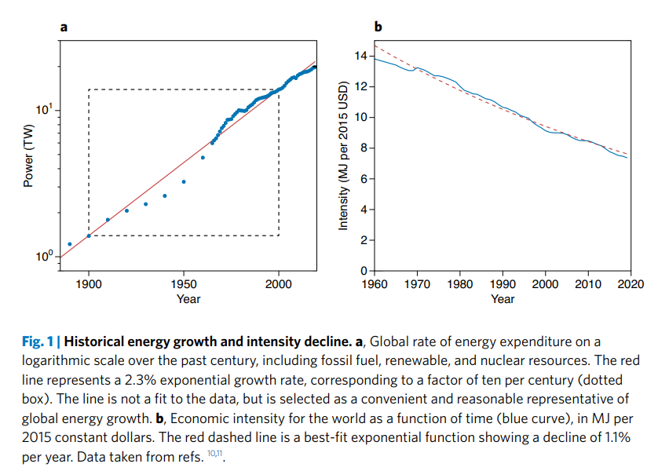

In 1960, Freeman Dyson wrote [a single page](https://fermatslibrary.com/s/search-for-artificial-stellar-sources-of-infrared-radiation)
"little joke"<a href="#littlejoke">xxa-littlejoke</a> about how an advanced civilization
undergoing exponential energy growth would quickly exeeds the capacity of their planet
and would have to start harvesting a reasonable fraction of the energy of their host star.

<aside> xxa-littlejoke
  As he says in <a href="https://youtu.be/huAIfzUoyhU?si=UaM-gGpLH84-iHrs&t=124">this interview</a>,
	or Angela Collier discusses in <a href="https://youtu.be/fLzEX1TPBFM?si=8Xv9fb-mzu0RKWlz">her video</a>.
</aside>

The paper goes through the basic math and physics for the energy and timescales required to build what has now become known as a [Dyson sphere](https://en.wikipedia.org/wiki/Dyson_sphere).

Dyson spheres started off as a far fetched sci-fi concept, but increasingly seem to be taken seriously by various corners of the internet, to the point where people are willing to put real money down on the possibility of a Dyson sphere by 2030 on prediction markets like [manifold.markets](https://manifold.markets/levifinkelstein/will-we-have-at-least-one-dyson-sph)

I think these people are crazy and wrong and I wanted to try to explain (for myself as much as anyone else) why.

## Some Background Energy Numbers

Fundamentally, I don't think we have the energy budget to build one, and I worry that most people vastly underestimate the amount of energy required to build one.

Let's establish some baseline numbers.  As a human, you're burning energy at $ \sim 100 \, \textrm{W} $  continuously (you're like a light bulb ($ 2000 \,\textrm{kcal/day}$) )

All of human civilization currently consumes energy at a rate of \~ $21 \,\textrm{TW} = 2 \times 10^{13} \,\textrm{W}$<a href="#civenergy">xxa-civenergy</a>

<aside> xxa-civenergy
    $186,000 \text{ TWh/year} = 21 \text{ TW}$. From
    Hannah Ritchie, Pablo Rosado, and Max Roser (2020) - “Energy Production and Consumption” Published online at OurWorldinData.org. Retrieved from: '<a href="https://ourworldindata.org/energy-production-consumption">https://ourworldindata.org/energy-production-consumption</a>' [Online Resource]
</aside>

The sun has a total luminosity of \~ $400 \, \textrm{YW} = 4 \times 10^{26} \, \textrm{W}$<a href="#sunluminosity">xxa-sunluminosity</a>

<aside>xxa-sunluminosity
    From <a href="https://en.wikipedia.org/w/index.php?title=Solar_luminosity&oldid=1281026335">wikipedia: Solar luminosity</a>.
</aside>

At $ 1 \,\textrm{AU}$ this is a solar flux of $ 1369 \,\textrm{W/m}^2$ so that the total solar flux incident on the earth is:

$$
  1369 \, \textrm{W/m}^2 \cdot \pi R^2 = 170 \,\textrm{PW} = 170\,000 \,\textrm{TW} = 1.7\times 10^{17} \,\textrm{W}
$$

This is why the science fiction idea of a Dyson sphere is so alluring, as far as the sun is concerned, the Earth takes up a very small fraction of the sky.<a href="#earthppm">xxa-earthppm</a>  On this planet we are limited to getting access to *only* 8,000 times the power we currently consume.<a href="#solarlimit">xxa-solarlimit</a>  Meanwhile, if we could capture some reasonable fraction of the total solar output, this is another factor of 2 billion in terms of our potential power draw.

<aside>xxa-earthppm
    $$\frac{\pi R_{\oplus}^2}{4 \pi (1 \text{ au})^2} \sim 1/2 \,\textrm{ppb}$$
</aside>

While these numbers seem large and out of the way, as laid out in the fantastic article [Limits to Economic Growth by Tom Murphy](https://tmurphy.physics.ucsd.edu/papers/limits-econ-final.pdf),<a href="#xxa-murphyarticle">xxa-murphyarticle</a> even these fantastical limits are very close in terms of exponential growth.

<aside>xxa-murphyarticle
    Murphy Jr, Thomas W. "Limits to economic growth." Nature Physics 18.8 (2022): 844-847.
</aside>

If we look at [ourworldindata](https://ourworldindata.org/energy-production-consumption), we can see that over the last 60 years or so, our primary energy consumption has been growing between -1% and 4% or so.  Let's make it a round 2.3% growth so that in a century we get a factor of 10.<a href="#century">xxa-century</a>

<aside>xxa-murphyarticle
    i.e. $e^{0.023 * 100} \sim 10$
</aside>

<figure id="owid">
  

  
  <figcaption>
  Figure xxf-energy. Annual change in primary energy consumption from <a href="https://ourworldindata.org/grapher/change-energy-consumption">ourworldindata</a>.
  </figcaption>
  

</figure>

As [Tom shows in his Figure 1](https://tmurphy.physics.ucsd.edu/papers/limits-econ-final.pdf), this is a great match for the growth in power consumption over a longer range

<figure id="tomarticlefig">
  

  
  <figcaption>
  Figure xxf-tomarticle. Historical energy growth. From
  Murphy Jr, Thomas W. "Limits to economic growth." Nature Physics 18.8 (2022): 844-847. <a href="https://tmurphy.physics.ucsd.edu/papers/limits-econ-final.pdf">[pdf]</a>
  </figcaption>
  

</figure>

The problem with exponentials, as we are well aware, is that if you extrapolate them they get very intense very quickly.  If you run this 2.3% growth exponential forward, it quickly becomes uncomfortable, as Tom shows in his [accompanying blog post](https://dothemath.ucsd.edu/2011/07/galactic-scale-energy/):

<figure id="tomblogfig">
  

  
  <figcaption>
  Figure xxf-tomblog. Projecting 2.3% energy growth into the future. From <a href="https://dothemath.ucsd.edu/2011/07/galactic-scale-energy/">Tom Murphy's blog post</a>.
  </figcaption>
  

</figure>

In a mere 275 years, i.e. as far forward as the year 1750 was back, we would exceed the total solar flux on land that we can reasonably capture (at 20% efficiency).  But if you want to ignore those limits, its only 345 years to get to 100% of the total solar flux on land, and only 400 years to get to the total solar flux on the Earth… period.

Our civilization is already operating at a global scale, and we are already close to some fundamental physical limits to what we can do on this planet.  This naturally makes people wonder about alternatives, makes people look to the stars, as they represent the only possibilities for a future that would support the level of economic growth and development for the next several hundred years that could resemble the last several hundred years.

Unfortunately, physics tends to stretch those dreams thin.

## Dyson's original paper

If you haven't already, it's worth taking a moment to read Dyson's original letter to Science that laid out the idea of a Dyson sphere: \[[Dyson's original paper](https://fermatslibrary.com/s/search-for-artificial-stellar-sources-of-infrared-radiation)\], it's only a single page.  The point of the original paper was to make the case that in SETI style searches for intelligent life elsewhere in the galaxy, we should consider advanced civilizations that may have built a structure around their star, and in so doing, modify the spectral emissions of that star.

To do this, he tries to lay out the feasibility of such a civilizational program.  He points out that in our solar system, we *reasonably* have access to the mass of Jupiter $ 2\times 10^{30}\,\textrm{g} $ and the total solar luminosity of $4\times 10^{33} \,\textrm{erg/s} = 4\times 10^{26} \,\textrm{W}$ as above.

The first thing Dyson points out is that while this kind of scale feels infeasible for us to achieve, with exponential growth being what it is, we might expect our civilization (if it had unencumbered growth) to reach that level in a mere 3000 years at 1% growth.  In the figure above, we see we reach total solar output in only 1350 years with the 2.3% rate of growth.

Dyson does some back of the envelope calculations to show that if we built a structure out of Jupiter (or a Jupiter equivalent of mass) at about 2 AU could be to 2 to 3 meters thick (and so one could conceivably live in it).  But of course to actually assemble such a structure would require dissembling Jupiter itself!

Dyson actually works this out for us, and says that to pull about Jupiter would require about $ 10^{44} \,\textrm{erg}$ and then makes this seems reasonable by pointing out that this would only take 800 years of total solar output.  Let's examine these numbers a little closer.

First as a rough back of the envelope estimate of the binding energy of a planet, we can just do some dimensional analysis and say that it should be on the order of:

$$
 \frac{G M^2}{R} = G \frac{(2\times 10^{30} \,\textrm{g})^2}{70\,000 \,\textrm{km}} \sim 4\times 10^{43}\,\textrm{erg} = 4\times 10^{36}\,\textrm{J}
$$

Where $M$ is the mass of the planet, $R$ is its radius and $G$ is the gravitational constant.  So far so good.  To pull apart a planet the size of Jupiter takes a lot of energy.  If we had at our disposal our entire solar output, it would take nearly a millennium to do it!

If we had a Dyson sphere already, something that captured a reasonable fraction of our total solar output, if we then dedicated all of that power to the singular task of ripping Jupiter apart, it would still take \~300 years to do so.

What if we didn't have the Dyson sphere yet? What if we only had access to the total solar flux on our own planet.  So, let's merely assume we have covered our entire planet in 100% efficient solar panels and similarly put the entire production towards dissembling Jupiter, how long would that take?

$$
\frac{4 \times 10^{36} \, \textrm{J}}{170\,\textrm{PW}} = 10^{12} \,\textrm{years}
$$

Our roughly 50x the total age of the universe!

As @[Adam Jermyn](mention://4f075286-1675-4d94-ad0b-41dac37deece/user/365bf37c-32b5-4dfb-bfdc-cc8d2bfe3f74)
However, you might object that we could use the power from the budding Dyson sphere (or swarm) to power further construction of the swarm.
Since $ dm/dt \propto dm $ for whatever mass fraction you've already eaten, the final answer will be only a constant factor larger than the original estimate of \~300 years.  This is true, but this is one of those cases where its illustrative to work out what that "constant factor" is. For Dyson's parameters, that constant factor is

$$
\log \frac{(4\times 10^{36} \, \textrm{J}) (1369 \,\textrm{W/m}^2) (70\,000\, \textrm{km}) }{(20 \,\textrm{TW}) (2 \,\textrm{m}) (3 \,\textrm{g/cm}^3) G (2\times10^{30} \,\textrm{g})}  \sim \log (3\times10^{13} ) \sim 30
$$

So it would *only* take \~$ 30 \times 300 \sim 10\,000$ years.

Given that we only unreasonably have at most another 275 years of sustained economic growth, I don't see how building a Dyson sphere is possible, or if it is it would take many many millennia.

## Mercury

Some modern proposals for a Dyson swarm seem to recognize that dissassembling Jupiter is perhaps a bit much and so instead propose more *modest* proposals, such as using 10% of the total mass of Mercury.  Let's imagine we try to do this in the next 25 years, as some people seem to believe is possible.

First, let's do a rough order of magnitude calculation.  The gravitational energy will be roughly:

$$
\frac{GMm}{R} = \frac{G \cdot 0.1 \cdot (3 \times 10^{23}\,\textrm{kg})^2}{2400 \,\textrm{km}} = 3\times 10^{29} \, \textrm{J}
$$

Which if we try to expend this much energy in the next 25 years, this equates to a power of:

$$
\frac{3\times 10^{29}\,\textrm{J}}{25 \,\textrm{years}} = 3\times 10^{20}\,\textrm{W} = 300\,000\,000 \,\textrm{TW}
$$

This exceeds the total solar flux on the earth by a factor of 2000x !

There is absolutely no way this can happen.  We would need a Dyson swarm to build one.

The Earth's finite limits are within reach.  As Tom points out in the article, currently the waste heat from our own energy production is only 10x smaller than the $ \sim 1 \, \text{W/m}^2$ forcing we worry about from Global warming.  Meaning, at 2.3% growth, within the next century, the *waste heat* from our own power production will match and thereafter dominate over the current effects of global warming with regards to warming the planet.  We don't have much headroom left.

## Conclusions

Overall, I haven't seen a lot of discussion in the wild about the energy requirements for things like Dyson spheres.  I was pleasantly surprised to see that Dyson himself at least thought about these implications.  For him, it was largely about the search for other intelligent life in the universe.

I worry that with a lot of exponential curves, its very easy to continue the dotted line, but all exponentials have to come to an end. They must.  There are always finite limits and even if those limits seem to be far away, with any exponential they come racing up exponentially fast.

One thing I'd like to try to do personally is be more aware of the limits.  Even in the context of things like AI scaling, I think its very easy for us to extrapolate a curve but not consider the costs associated with that extrapolation, and whether those costs are in keeping with physical constraints.

Humanity is already operating at a global scale, we honestly do not have a lot of additional headroom left to grow.  Machine learning has been growing exponentially, but may not have very much farther it can go, given data or compute constraints.  Seems like the time is now to think more judiciously about how to make the best of what growth we have left.

If you want to learn more about our Finite planet and some of the challenges we'll face with energy, I highly recommend [Tom Murphy's Book,](https://open.umn.edu/opentextbooks/textbooks/980)<a href="#murphybook">xxa-murphybook</a> which is freely accessible online.

<aside>xxa-murphybook
    Murphy Jr, Thomas W. Energy and human ambitions on a finite planet. 2021. <a href="https://open.umn.edu/opentextbooks/textbooks/980">[website]</a>
</aside>

The bottom line is that the next 300 years are going to have to look different than the previous 300 years.  Maybe they look different because we escape the bounds of this planet and start living some cyberpunk future, or maybe we'll face the consequences of hitting the finite bounds of this planet.  In either case, the present is quite special and very near a turning point.
