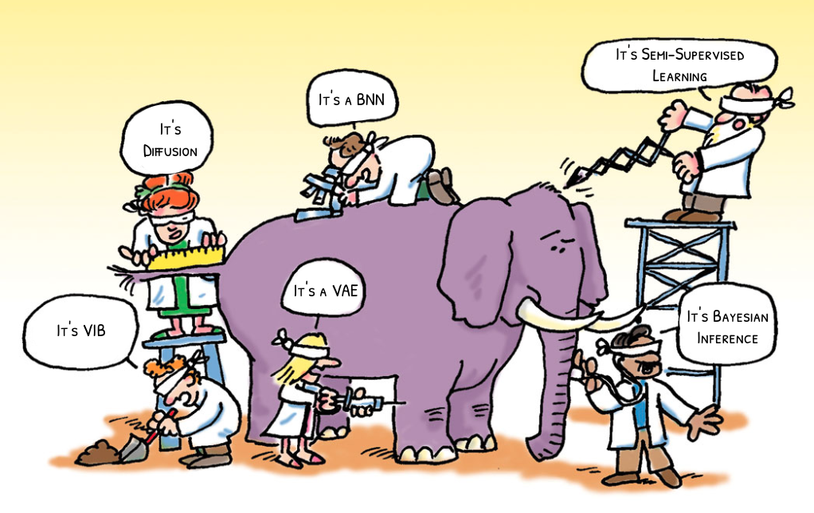

The more I work on machine learning, the more I'm embarrased to admit that most of what I'm worked on is
all so blindingly simple.  At the core of essentially all of modern machine learning is a single
objective: KL minimization, and I think there is a very simple recipe to follow to rederive
most of the named objectives out there.  In the past I've discussed some of the 
<a href="kl.html">special properties of KL divergence</a>, or how you can derive
<a href="diffusion.html">VAEs or Diffusion Models</a> by means of a simple KL objective, but in 
light of a recent <a href="https://www.alexalemi.com/talks/information-theory-for-representation-learning.html">talk</a> I gave at the InfoCog Workshop at NeurIPS 2024, I'd like to prepare essentially a written copy of that talk.<a href="#multivariate-ib">1</a>

<aside> 1
This is also essentially my own retelling of <a href="https://www.cs.huji.ac.il/labs/learning/Theses/Slonim_PhD.pdf">Noam Slonim's thesis on the Multivariate Information Bottlneck</a>.
</aside>

<figure id="#conditional" class="right">
  

  
  <figcaption>
  Figure 1. The elephant in the room is KL divergence or the relevant entropy.<a href="#figattribution">2</a>

  </figcaption>
  

</figure> 

<aside> 2
Cartoon modified from Kevan C. Herold, Jeffrey A. Bluestone ,Type 1 Diabetes Immunotherapy: Is the Glass Half Empty or Half Full?. Sci. Transl. Med.3,95fs1-95fs1(2011).
<a href="https://doi.org/10.1126/scitranslmed.3002981">DOI:10.1126/scitranslmed.3002981</a>.
</aside>

## KL Divergence as Expected Weight of Evidence

Before we get into it, we need to make sure we're all starting on the same page.  I've written <a href="kl.html">before</a> about part of what makes KL divergence or the relative entropy so special, but for the purposes of the journey we are about to undertake, let's use the interpretation of KL divergence as <a href="kl.html#expected-weight-of-evidence">an expected weight of evidence</a>, which I'll briefly repeat here.

Imagine we have two hypotheses $P$ and $Q$ and we're trying to decide which of these two models is a better model of the world.  We go out an collect some data $D$ and would like to use that data to help us decide between the two models.  Being good probabilistic thinkers with a penchant for gambling, what we're interested in is:

$$ \frac{\Pr(P|D)}{\Pr(Q|D)}, $$

the <a href="https://en.wikipedia.org/wiki/Odds"><i>odds</i></a> of $P$ versus $Q$. Using <a href="https://en.wikipedia.org/wiki/Bayes\%27_theorem">Bayes rule</a> we can express this as:

$$ \frac{\Pr(P|D)}{\Pr(Q|D)} = \frac{\Pr(D|P)}{\Pr(D|Q)} \frac{\Pr(P)}{\Pr(Q)}, $$

the product of the <a href="https://en.wikipedia.org/wiki/Likelihood_function"><i>likelihood</i></a> ratio that the data we observed were generated by model $P$ and $Q$ times the <i>prior odds</i> of the two models.  Taking a logarithm of both sides turns the product into an easier to work with sum:

$$ \log \frac{\Pr(P|D)}{\Pr(Q|D)} = \log \frac{\Pr(D|P)}{\Pr(D|Q)} + \log \frac{\Pr(P)}{\Pr(Q)}. $$

Now, the <i>posterior log odds</i> is expressed as the sum of the <i>weight of evidence</i> plus the <i>prior log odds</i> of the two hypotheses.

This *weight of evidence* tells us how much to update our beliefs in light of evidence.  If you picture a sort of Belief-O-Meter™ for your own beliefs, each bit of independent evidence gives you an additive update for the meter, pushing your beliefs either left or right, towards either $P$ or $Q$.  For simple hypothesis taking the form of probability distributions, this weight of evidence is just the log density ratios of the data under the models:

$$ \log \frac{\Pr(D|P)}{\Pr(D|Q)} \to \log \frac{p(D)}{q(D)}. $$

What then is <a href="https://en.wikipedia.org/wiki/Kullback\%E2\%80\%93Leibler_divergence">the Kullback-Leibler (KL) divergence</a>? Imagine if one of our two hypothesis is actually true.  If $P$ was the probability distribution governing the actual world, the <i>expected weight of evidence</i> we would accumulate from observing some data would be:

$$ I[p;q] \equiv \int dx\, p(x) \log \frac{p(x)}{q(x)}. $$

We can interpret the KL divergence as a measure of how quickly we would be able to discern between hypotheses $P$ and $Q$ if $P$ were true.  Similarly, the <i>reverse KL</i> is:

$$ I[q;p] \equiv \int dx\, q(x) \log \frac{p(x)}{q(x)}, $$

a measure of how quickly we'd be able to discern between $P$ And $Q$ if $Q$ were true.  Suddently the assymmetry of the KL divergence, an issue that often causes costernation is no longer a mystery.  We should expect the expected weight of evidence to be asymmetric.   As an extreme example, imagine we were trying to decide between two hypothesis regarding some coin flips we are about to observe.  $P$ is the hypothesis that the coin is fair while $Q$ is the hypothesis the coin is a cheat, double-headed coin.  In this case, if we actually had a fair coin, we expect to be able to perfectly discern the two hypotheses (infinite KL) because we will eventually observe a tails, an impossible situation under the alternative ($Q$) hypothesis.  Meanwhile, if the coin is actually a cheat, we'll be able to collect, on average, 1 bit of evidence per flip in favor of the hypothesis that the coin is a cheat, but we will only ever observe heads and so never be able to perfectly rule out the possibility that the coin is fair and we've simply observed some miracle.<a href="#million">3</a>

<aside> 3
As a true aside, people often say "one in a million" but lack a good mental model of just how rare that is.  20 heads in a row for a fair coin is a one in a million event. This fun fact and others can be found <a href="https://www.stat.berkeley.edu/~aldous/Real-World/million.html">here, at David Aldous's Home Page</a>.
</aside>

## Mathematical Properties

In what follows, we'll need to use two mathematical properties of the KL divergence. The first is that the KL divergence is non-negative, i.e. the lowest it can be is zero:

$$ I[p;q] \equiv \int dx\, p(x) \log \frac{p(x)}{q(x)} \geq 0, $$ 

which I'll leave as an exercise to the reader, or you can see a proof in the <a href="kl.html#non-negative-proof">previous post</a>. In the context of our interpretation of KL divergence as an expected weight of evidence, the non-negativity of KL divergence means, essentially, that the world can't lie to us.  If we are trying to decide between two hypotheses, and one of them happens to be correct, we have to, we must, we have to, we must, on average, be pushed in the direction of the correct hypothesis.

The other property we'll use is the *monotonicity* of the KL divergence.

## Universal Recipe

## Density Estimation

## Supervised Learning

## Variational Autoencoders

## Variational Information Bottleneck

## Diffusion

## Semi-Supervised Learning

## Bayesian Inference

## Bayesian Neural Network

## Variational Prediction

## Appendix - Pointwise Bounds
