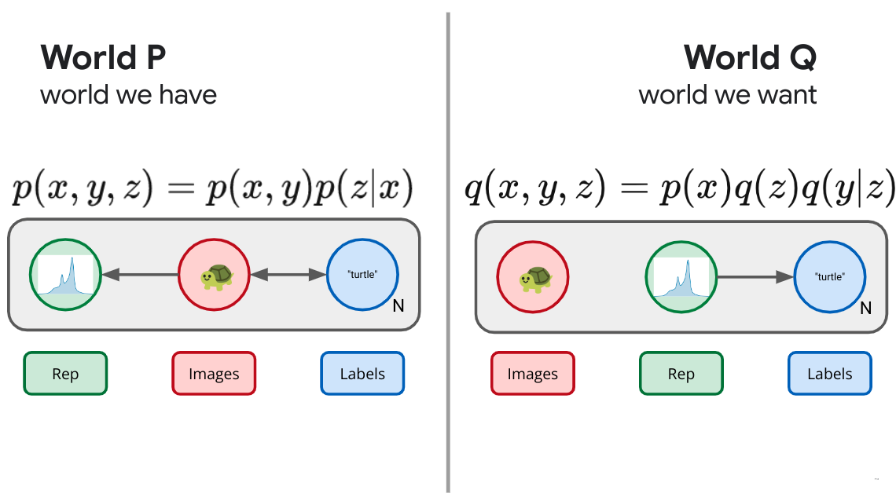

Modern machine learning is a sea of initialisms: VAE, VIB, VDM, BBB, VB, etc.
But, the more time I spend working in this field the more I come to appreciate
that the core of essentially all modern machine learning methods is a single
universal objective: 
<a href="https://en.wikipedia.org/wiki/Kullback%E2%80%93Leibler_divergence">Kullback-Leibler (KL) divergence</a>
minimization.  Even better, there is a very
simple *universal recipe* you can follow to rederive most of the named
objectives out there.  Understand KL, understand the recipe, and you'll
understand all of these methods and be well on your way to deriving your own.

<!--
The more I work on machine learning, the more I'm embarrassed to admit that most of what I'm worked on is all so blindingly simple.  At the core of essentially all of modern machine learning is a single
objective: KL minimization, and there is a very simple recipe to follow to re-derive
most of the named objectives out there.  -->

In the past I've discussed some of the 
<a href="kl.html">special properties of KL divergence</a>, and how you can derive
<a href="diffusion.html">VAEs or Diffusion Models</a> by means of a simple KL objective. 
What follows is an extension of those ideas, essentially a written version of a recent 
<a href="http://localhost:8000/talks/information-theory-for-representation-learning.html">talk</a>
<a href="https://docs.google.com/presentation/d/1YwgRzjWATHVX60Me6qOEOxQIiFjxdqO0_9jdAWXFx74/present?usp=sharing&resourcekey=0-T4ume8tMl__GoYZnKgHMEg">[slides]</a> 
I gave at the InfoCog Workshop at NeurIPS 2024.
<a href="#multivariate-ib">xxa-attribution</a>

<aside> xxa-attribution
This is also essentially my own retelling of <a href="https://www.cs.huji.ac.il/labs/learning/Theses/Slonim_PhD.pdf">Noam Slonim's thesis on the Multivariate Information Bottleneck</a>.
</aside>

<figure id="#conditional" class="right">
  

  
  <figcaption>
  Figure xxf1. The elephant in the room is KL divergence or the relevant entropy.<a href="#figattribution">xxa2</a>

  </figcaption>
  

</figure> 

<aside> xxa2
Cartoon modified from Kevan C. Herold, Jeffrey A. Bluestone, Type 1 Diabetes Immunotherapy: Is the Glass Half Empty or Half Full?. Sci. Transl. Med.3,95fs1-95fs1(2011).
<a href="https://doi.org/10.1126/scitranslmed.3002981">DOI:10.1126/scitranslmed.3002981</a>.
</aside>

## KL Divergence as Expected Weight of Evidence

Before we get into it, we need to make sure we're all starting on the same
page.  Because KL divergence is so fundamental and special (as I've written
about <a href="kl.html">before</a>) it has many different interpretations. For
our purposes, the most useful interpretation is as <a
href="kl.html#expected-weight-of-evidence">an expected weight of evidence</a>.<a href="#woe">xxa-woe</a>
I'll briefly build that up here.

<aside> xxa-woe
I think weight of evidence is one of the most underappreciated concepts.  For a nice overview see: <i>Weight of Evidence: A Brief Survey</i> by I.J. Good. <a href="https://link.springer.com/article/10.1007/BF01106578">[pdf]</a>.
</aside>

Imagine we have two hypotheses $P$ and $Q$ and we're trying to decide which of these two is a better model of the world.  We go out an collect some data $D$ and would like to use that data to help us discriminate between the two models.  Being good probabilistic thinkers with a penchant for gambling, what we're interested in is:

$$ \frac{\Pr(P|D)}{\Pr(Q|D)}, $$

the <a href="https://en.wikipedia.org/wiki/Odds"><i>odds</i></a> of $P$ versus $Q$, given the data $D$. Using <a href="https://en.wikipedia.org/wiki/Bayes%27_theorem">Bayes rule</a> we can express this as:

$$ \frac{\Pr(P|D)}{\Pr(Q|D)} = \frac{\Pr(D|P)}{\Pr(D|Q)} \frac{\Pr(P)}{\Pr(Q)}, $$

the product of the <a href="https://en.wikipedia.org/wiki/Likelihood_function"><i>likelihood</i></a> ratio that the data we observed were generated by model $P$ and $Q$ times the <i>prior odds</i> of the two models.  Taking a logarithm of both sides turns the product into an easier to work with sum:

$$ \log \frac{\Pr(P|D)}{\Pr(Q|D)} = \log \frac{\Pr(D|P)}{\Pr(D|Q)} + \log \frac{\Pr(P)}{\Pr(Q)}. $$

Now, the <i>posterior log odds</i> is expressed as the sum of the <i>weight of evidence</i> plus the <i>prior log odds</i> of the two hypotheses.

<figure id="#belief-of-meter class="right">
  

  
  <figcaption>
  Figure xxf0. Belief-O-Meter.
  </figcaption>
  

</figure> 

This *weight of evidence* tells us how much to update our beliefs in light of evidence.  If you picture a sort of Belief-O-Meter™ for your own beliefs, each bit of independent evidence gives you an additive update for the meter, pushing your beliefs either toward $P$ or toward $Q$.  For simple hypothesis taking the form of probability distributions, this weight of evidence is just the log density ratios of the data under the models:

$$ \log \frac{\Pr(D|P)}{\Pr(D|Q)} \text{ becomes } \log \frac{p(D)}{q(D)}. $$

<!-- TODO Explain the change in notation here. -->

<!-- What then is <a href="https://en.wikipedia.org/wiki/Kullback%E2%80%93Leibler_divergence">the Kullback-Leibler (KL) divergence</a> ? -->
OK, so what does this have to do with the <a href="https://en.wikipedia.org/wiki/Kullback%E2%80%93Leibler_divergence">KL divergence</a>?
Imagine if one of our two hypotheses is actually true.  If $P$ was the probability distribution governing the actual world, the <i>expected weight of evidence</i> we would accumulate from observing some data would be, the KL divergence:<a href="#brakets">xxa3</a>

$$ I[p;q] \equiv \int dx\, p(x) \log \frac{p(x)}{q(x)} \equiv \left\langle \log \frac{p(x)}{q(x)} \right\rangle_{p(x)} . $$
<aside> xxa3
To clean up the notation, I like using brakets: $ \langle \cdot \rangle_p \equiv \mathbb{E}_{p}[\cdot] \equiv \int dx\, p(x) [\cdot]$, and to clean things up further (or because I'm lazy) I'll often leave off the subscript saying which distribution the brakets are to be taken with respect to, in any of those cases you can assume its a full joint $p$ distribution (over any variables that are otherwise unbound).
</aside>

Therefore, we can interpret the KL divergence as a measure of how quickly we would be able to discern between hypotheses $P$ and $Q$ if $P$ were true.  Similarly, the <i>reverse KL</i> is:

$$ I[q;p] \equiv \int dx\, q(x) \log \frac{q(x)}{p(x)} \equiv \left\langle \log \frac{q(x)}{p(x)} \right\rangle_{q(x)}, $$

a measure of how quickly we'd be able to discern between $P$ and $Q$ if $Q$ were true.  Suddenly, the asymmetry of the KL divergence, an issue that often causes consternation is no longer a mystery.  We should expect the expected weight of evidence to be asymmetric.   As an extreme example, imagine we were trying to decide between two hypothesis regarding some coin flips we are about to observe.  $P$ is the hypothesis that the coin is fair while $Q$ is the hypothesis the coin is a cheating, double-headed coin.  In this case, if we actually had a fair coin, we expect to be able to perfectly discern the two hypotheses (infinite KL) because we will eventually observe a tails, an impossible situation under the alternative ($Q$) hypothesis.  Meanwhile, if the coin is actually a cheat, we'll be able to collect, on average, 1 bit of evidence per flip in favor of the hypothesis that the coin is a cheat, but we will only ever observe heads and so never be able to perfectly rule out the possibility that the coin is fair and we've simply observed some miracle.<a href="#million">xxa4</a>

<aside> xxa4
As a true aside, people often say "one in a million" but lack a good mental model of just how rare that is.  20 heads in a row for a fair coin is a one in a million event. This fun fact and others can be found <a href="https://www.stat.berkeley.edu/~aldous/Real-World/million.html">here, at David Aldous's Home Page</a>.
</aside>

## Mathematical Properties

In what follows, we'll need to use two mathematical properties of the KL divergence. The first is that the KL divergence is non-negative, i.e. the lowest it can be is zero:

$$ I[p;q] \equiv \int dx\, p(x) \log \frac{p(x)}{q(x)} \geq 0, $$ 

which I'll leave as an exercise to the reader, or you can see a proof in the <a href="kl.html#nonnegative">previous post</a>. In the context of our interpretation of KL divergence as an expected weight of evidence, the non-negativity of KL divergence means, essentially, that the world can't lie to us.  If we are trying to decide between two hypotheses, and one of them happens to be correct, we have to, we must, we have to, we must, on average, be pushed in the direction of the correct hypothesis.  Even the Devil can't construct a $q \neq p$ that we would be led to believe after seeing enough samples from $p$.

The other property we'll use is the *monotonicity* of the KL divergence.  This is a generalized version of the [data processing inequality](https://en.wikipedia.org/wiki/Data_processing_inequality).  If we perform some kind of processing on our random variables, it should only make it harder to discern between two hypotheses, not easier.  In particular, the version we'll need today concerns *marginalization*, if I have two joint distributions defined on two random variables, it always has to be the case that the KL divergence between their two marginals must be less than or equal to the joint KL:
$$ \int dx\, dy\, p(x,y) \log \frac{p(x,y)}{q(x,y)} \geq \int dx\, p(x) \log \frac{p(x)}{q(x)}, $$
which is easy to show if you decompose $p(x,y) = p(x) p(y|x)$ and use the fact that all KL divergences (including the conditional $I[p(y|x);q(y|x)] \geq 0$ are non-negative.

Again, in terms of our current interpretation, this makes sense. If I have some beliefs defined over several variables, if I only get to observe some subset of them, it should be harder for me to discern the beliefs.  The less I look at, the less I see.

## Universal Recipe

With the prerequisites out of they way we're ready to see the "universal recipe" for generating objectives. 

In machine learning, broadly, we build neural networks and need some guidance on how to set their parameters.  An *objective* acts like a score that ranks each possible setting and guides our search in the space of parameters for a *good* one.  How *ought* we value, or judge each possible solution?  

Fundamentally, there are two things in conflict.  There is a the *real world* with all of its causal depedencies and structure, a great deal of which we can no influence on.  Data comes from some data generating process wholly outside of our control.  On top of this data we are often interested in building machines to process the data, which may exist in the real world but have a billion or more knobs we need guidance on how to set.  In contrast to the real world, there is the *dream world*, the world of our desires, the world as it wish it were to be.  There's a simple story we *wish* were true that we could tell about the data and its causal structure. When doing Bayesian inference this is the *generative* model you use to describe the data.  If we're being honest with ourselves, it isn't that the data we observe actually comes from our generative model, we only wish that were the case.  So, we have two different stories we could try to tell about the world, the accurate real world description and the wishful dream world one.

The goal is to make the real world look more like our dreams.  Given that KL divergence is the *proper* way to measure how similar two distributions are, we need only minimize the KL divergence between the real world -- the world we can sample from -- and the world as we wish it were.  The smaller that KL can become, the harder it becomes for us or anyone else to distinguish between our dreams and reality.  In steps:

 1. Draw a causal graphical model corresponding to the world as it is, the true world $P$.
 2. Augment the real world with any components you wish to add.
 3. Draw the world of your desires, what success would look like, what you are targeting, the dream world $Q$.
 4. Minimize $I[P;Q]$.
 5. ...
 6. Profit!

As simple as it sounds, in retrospect a lot of machine learning is simply following this recipe.  Let's repeat this ad nauseam.

## Density Estimation

We'll start with the problem of density estimation.  Let's say we have some black box that generates samples.  This is the real world $P$, outside of our control.  Despite not knowing how $p(x)$ is structured, we can push the button on the black box to generate samples.  What do we wish for? We wish we instead have a nice description of those same images.  We wish that those images instead came from a box of our own design, some parametric model or probability distribution with knobs that we can adjust to bring it into alignment with the real world, our dream world $q_\theta(x)$ with parameters $\theta$.

<figure id="#density-estimation" class="right">
  

  
  <figcaption>
  Figure xxf2. Density Estimation. <a href="#imgkey">xxa-figkey</a>
  </figcaption>
  

</figure> 

<aside>xxa-figkey
These figures are meant to be graphical models, where the plates represent repeated samples (here $N$), and each circle represents a random variable.  The arrows denote causal relationships between the variables.  I try to keep the colors somewhat consistent, but also label the random variables in each.  The turtle emoji (🐢) is meant to denote images, "turtle" markes a label, the little plot will represent a <i>representation</i>, $D$ is data, $\theta$ are parameters and $\phi$ is the state of the universe.
</aside>

Following the recipe, our recipe then is to minimize the KL divergence between the real world and our ideal one:

$$ I[p; q] = \left\langle \log \frac{p(x)}{q_\theta(x)} \right\rangle_p $$

To belabor the point, in terms of our interpretation of KL divergence, this makes sense. $I[p;q]$ measures how easy it is for us to distinguish between $p$ and $q$ using samples from $p$. We have samples from $p$, while $q_\theta(x)$ is a whole set of worlds we can index with our parameters $\theta$.  We seek a setting of those parameters which make it as difficult as possible for us or anyone else to tell the difference between the real world $P$ and our imaginary one $Q$.  Minimizing the KL divergence does exactly that.  

Unfortunately, naively, this objective requires that we be able to evaluate $\log p(x)$, the density the real world assigns to the samples it generates.  This is out of reach, we don't know what the real world is doing, but here is where the KL divergence helps us out yet again.  It decomposes into two terms:

$$ \underbrace{\left\langle \log \frac{p(x)}{q_θ(x)} \right\rangle}_{I[p;q]} = \underbrace{\left\langle \log p(x) \right\rangle \vphantom{\left\langle \frac p q \right\rangle} }_{-H[p]} + \underbrace{\left\langle -\log q_θ(x) \right\rangle \vphantom{\left\langle \frac p q \right\rangle}}_{H[p;q]},  $$

the (negative) *entropy* of the true data generating process ($H[p]$), and the *cross-entropy* between $p$ and $q$: ($H[p;q]$), aka the *likelihood* of the data samples from $p$ under $q$.  The entropy of the true data generating process isn't something that we control, as far as we're concerned its a constant and we don't need to worry about it. Just like that, we see that minimizing the KL divergence between the real world and the world of our desires, in this simple single random variable setup recovers ordinary minimum [cross-entropy](https://en.wikipedia.org/wiki/Cross-entropy) learning, aka maximum likelihood learning, but with a different and hopefully well-motivated origin.  We adjust the parameters of our model $q_\theta(x)$ so as to maximize the likelihood of the data $\log q_\theta(x)$, why? So that we and anyone else would struggle as much as possible to distinguish between the real world and our model.  With this same motivation, lots of other machine learning objectives will fall into place.

There are two caveats worth discussing but I've pushed them to appendices.  [The first](#appdim) is that it bugs me that splitting the log density ratio is awkward in terms of dimensional analysis, and [the second](#appemp) is that while this gives us a meaningful objective, it requires that we be able to take expectations with respect to the true distribution.  If we have only finite samples in the form of a training set, that introduces complications.  I want to acknowlege that reusing a fixed dataset is a problem that has to be dealt with, I want to highlight that it isn't a problem with the *objective*.  Our KL divergence objective is telling us the right thing to do, we need to work out real world issues about how to best implement that objective.  This requires some real world complications that are outside the scope of this discussion.

## Supervised Learning

Let's complicate things slightly.  Instead of imagining that we have a single random variable in the real world, imagine instead we have a pair of variables, $X$ and $Y$.  For concreteness, imagine the $X$ are images and the $Y$ are their associated labels in some dataset. 

What are we after? What does success look like? Let's imagine that what we desire is the ability to assign labels to data.  What we wish were the case was that we used the same process to draw the images $q(x) = p(x)$, but instead of using the real world process to assign labels, ideally the labels would instead come from a device under our control: $q_\theta(y|x)$. <a href="#theta">xxa5</a>.  Just as before, we simply minimize the KL divergence between these two joints and we obtain an objective:

<figure id="#supervised-learning" class="right">
  

  
  <figcaption>
  Figure xxf3. Supervised Learning.
  </figcaption>
  

</figure> 

<aside> xxa5
I'm going to start dropping the subscript $\theta$ for the parameters.
</aside>

$$ \left\langle \log \frac{p(x,y)}{p(x)q(y|x)} \right\rangle, $$

Just as above, when we drop constants outside of our control, we end up with the usual maximum likelihood objective we are used to:

$$ \left\langle \log \frac{p(x)p(y|x)}{p(x)q(y|x)} \right\rangle = \left\langle \log \frac{p(y|x)}{q(y|x)} \right\rangle. $$
With the same caveats about proper handling of dimensions and issues stemming from using a fixed set of finite samples.

This conditional likelihood optimization objective is truly the workhorse of modern machine learning.  However, I feel as thought its a bit dishonest.  In practice we rarely care too much about the actual predictive task we are mimicking with our parametric conditional density.  Very few people actually care about assigning [ImageNet](https://en.wikipedia.org/wiki/ImageNet) labels to images.  Instead, the explosion in deep learning is mostly due to a happy little accident.  When we train very large, very expressive conditional distributions to minimize the conditional KL for something like ImageNet labeling with large datasets, we've discovered that the *representations* formed by some intermediate (usually penultimate) layer in that neural network are useful for a wide array of different image tasks. This didn't have to be the case, but we got a bit lucky.  

What if we wanted to learn a useful representation? What would true representation learning look like?

## Variational Autoencoders

So far we've only ever represented the world as it *is* and haven't yet taken the step of *augmenting* the *real world* with something new.  If we want to learn a representation, that's something that lives in the real world. That's a new
random variable.

Let's start with an unsupervised case.  We have images and we want to form a representation of those images.  In our real world, we have the images $X$ drawn from some distribution outside our control ($p(x)$).  Now we'll *augment* the 
real world with a new random variable $Z$; our *representation*.  We'll parameterize this with a neural network $p(z|x)$ that defines a tractable distribution for our stochastic representation $Z$. This is our *encoder*, which maps an image $X$ to a distribution for its representation. 
We want to consider a whole slew of possible *real worlds*, each world consisting of a different setting of the parameters of our encoder, and thus each world consisting of a different joint distribution $p(x,z)$.  Now our parameters $\theta$ essentially index one of
a wide array of possible joint distributions $p(x,z)$.  How do we decide amongst these?  What does success look like?  We are seeking a world in which we can *encode* images into a useful representation $p(z|x)$, one way to define success would be if those learned representations were really like *latents* for the images themselves.  Wouldn't it be swell if instead the world worked by looking at our own learned representation and used that to formulate the images themselves?  Wouldn't it be grand if that joint distribution factorized in the opposite direction: $q(x,z) = q(z)q(x|z)$.  This is the usual generative model story, where we first draw a latent variable $z$ from some prior distribution and then *decode* it through a stochastic map $q(x|z)$ for formulate our image.  Such a latent would be demonstrably useful for generating images.  

<figure id="vae" class="right">
  

  
  <figcaption>
  Figure xxf4. Variational Autoencoders.
  </figcaption>
  

</figure> 

Having defined both the real worlds under consideration $p(x,z)$ and the definition of success $q(x,z)$, our objective is the universal one of minimizing the KL divergence betwixt the two, from $p$ to $q$.  We try to make it as hard as possible for us or anyone else to distinguish between the real world in which we send images forward through an encoder to form a representation and some hypothetical world in which those representations were drawn from some prior and acted as a latent for a decoder that generated images.  We've just recreated the ELBO or Evidence Lower Bound Objective:

$$ \left\langle \log \frac{p(x,z)}{q(x,z)} \right\rangle_p = \left\langle \log \frac{p(x)p(z|x)}{q(x|z)q(z)} \right\rangle_p \geq 0. $$

Since this is a joint KL and all KLs are nonnegative, this objective is non-negative.  Furthermore, because of the monotonicity of KL, we know this is a bound on something we might care about, the marginal KL of our generative or reverse path:
$$ \left\langle \log \frac{p(x)p(z|x)}{q(z|x)q(z)} \right\rangle_p \geq \left\langle \log \frac{p(x)}{q(x)} \right\rangle_p  \geq 0. $$
So, as a bonus, if we push down on this joint KL objective, since this bounds the marginal KL on $X$, we can be assured that this machine composed of three parts, the encoder $p(z|x)$, decoder $q(x|z)$ and marginal (or prior) $q(z)$ will, as we adjust their tunable parameters, additionally make progress on the generative path: $z \sim q(z), x \sim q(x|z)$ itself being as indistinguishable as possible from the original image generating process $p(x)$.  Building and training the representative learning objective, as a side effect, ensures we also manage to build a good generative model.

We can split this objective up and name the various terms:
$$ \underbrace{\left\langle -\log q(x|z) \vphantom{\left\langle \frac p q \right\rangle} \right\rangle_p}_{D} + \underbrace{\left\langle \log \frac{p(z|x)}{q(z)}\right\rangle_p}_{R} \geq \underbrace{\left\langle -\log q(x) \vphantom{\left\langle \frac p q \right\rangle} \right\rangle_p}_{L} \geq \underbrace{\left\langle -\log p(x) \vphantom{\left\langle \frac p q \right\rangle} \right\rangle_p}_{H}, $$
or in short:
$$ D + R \geq L \geq H, $$

<aside> xxa-broken
<i>Fixing a Broken ELBO</i>. AA Alemi, B Poole, I Fischer, JV Dillon, RA Saurous, K Murphy. ICML 2018. arXiv: <a href="https://arxiv.org/abs/1711.00464">1711.00464</a>.
</aside>
a geometric story we tell in more detail in prior work.<a href="#brokenelbo">xxa-broken</a>  The first term, the *distortion*, measures how well we are able to recover the original image after encoding it with the encoder $z \sim p(z|x)$ and then trying to decode back to the original image $q(x|z)$.  The second term in the objective is the *rate*, which measures the information theoretic cost of the encoding itself.  If Alice and Bob were attempting to communicate the encoding $z$, the KL between the encoding distribution and the prior measures the excess cost of communicating the encoding.

If we are careful to split up the objective into its various reparameterization independent components, we can also explore some trade-offs between the different terms in the objective, adding some Lagrange multipliers, obtaining the $\beta$-VAE.<a href="#betavae">xxa-betavae</a>:
$$ \left\langle -\log q(x|z) \right\rangle_p + \beta \left\langle \log \frac{p(z|x)}{q(z)}\right\rangle_p. $$

<aside> xxa-betavae
<i>beta-VAE: Learning Basic Visual Concepts with a Constrained Variational Framework</i>.
I Higgens et al. ICLR 2016. <a href="https://openreview.net/forum?id=Sy2fzU9gl">[OpenReview]</a>.
</aside>

All told, the universal recipe has given us a proper *representation learning* objective, albeit unsupervised.  We have defined what it could mean for a representation to be a good one and we are able to search now in the space of all possible representations.  Unfortunately, a bit is a bit and unless we bring some kind of auxiliary information to the table, the success and utility of this objective is often left to inductive biases in our particular choices of variational families.

## Variational Information Bottleneck

If we want to be a bit more explicit in our representation learning objectives, we could *color the bits* by bringing and auxiliary variable to the table.  Imagine our real world distribution consists of pairs, $(x,y)$ drawn from some joint distribution $p(x,y)$ outside of our control.  Imagine images $X$ and labels $Y$.  As before, we can augment this world with a new random variable $Z$, a *representation*, which, in this example, we are interested in depending only on the image part, $p(z|x)$.  We do this because we'd like to be able to compute the representation of some downstream image without having access to its label.  As before, we've now defined a whole slew of possible worlds, consisting of all possible encoding distributions paired with our joint input distribution $p(x,y,z) =p(x,y)p(z|x)$.  How do we decide amongst these? What does success look like?  Let's define success as being able to use our learned representation $Z$, not to recreate the image, but only predict the auxiliary information $Y$.  This gives us a set of diagrams as in Figure xxf5 below.

<figure id="vib" class="right">
  

  
  <figcaption>
  Figure xxf5. Variational Information Bottleneck.
  </figcaption>
  

</figure> 

<aside> xxa-broken
<i>Deep Variational Information Bottleneck</i>. AA Alemi, I Fischer, JV Dillon, K Murphy. ICLR 2017. arXiv: <a href="https://arxiv.org/abs/1612.00410">1612.00410</a>.
</aside>
Following the universal recipe and taking the KL divergence between these two joints lets us reinvent the Variational Information Bottleneck:<a href="#vib">xxa-vib</a>

$$ \left\langle \log \frac{p(y|x) p(z|x)}{q(y|z) q(z)} \right\rangle_p \geq \left\langle \log \frac{p(y|x)}{q(y|x)}\right\rangle_p \geq 0. $$
Because KL is monotonic, this joint objective bounds the marginal conditional likelihood and we can rest assured that our predictive engine is still trying to mimic the labeling distribution.  This objective learns a representation that specifically aims to retain only the information that is relevant to predicting the auxiliary information contained in $Y$.  Because the objective is representation centric, we also learn a stochastic representation that can truly compress the inputs.

<!-- TODO: more info and some background of how VIB behaves. -->

## Semi-Supervised Learning

We say that VAEs came from trying to design a representation that could use the learned representation could recreate the images, and that VIB was motivated by saying we could use the learned representation to predict an auxiliary variable.  What if we instead wanted to do both?

<figure id="semi-supervised" class="right">
  

  
  <figcaption>
  Figure xxf7. Semi-Supervised Variational Autoencoder.
  </figcaption>
  

</figure> 

We then obtain a type of semi-supervised VAE:

$$ \left\langle -\beta \log q(x|z) - \gamma \log q(y|z) + \log \frac{p(z|x)}{q(z)} \right\rangle_p. $$
Here $\beta$ and $\gamma$ have been inserted to let us play with the trade-offs between how much emphasize we place on the reconstruction and auxiliary variable respectively.

## Diffusion

As I outline in more detail in an <a href="diffusion.html">earlier post</a>, modern diffusion models can also be cast in this universal objective form.  We imagine a simple fixed forward process that iteratively adds Gaussian noise to an image, and try to learn a reverse process parameterized in a clever way.

<figure id="diffusion" class="right">
  

  
  <figcaption>
  Figure xxf6. Variational Diffusion.
  </figcaption>
  

</figure> 

The Variational interpretation of diffusion models makes clear that they are little more than deep hierarchical VAEs, though with some tricks that make training them much more tractable than a general hierarchical VAE.

## Bayesian Inference

So far we've focused on *local representation learning*, wherein we want to form a representation of each example or image.  Let's now think a bit about *global representation learning*.  We are going to observe an entire dataset and want to somehow summarize what we've learned.  Now we imagine a forward process in which we sample a whole set of data, $D$, and need to form some kind of summary statistic or description of the data: $p(\theta|D)$. What would success look like here?  We'll if we aren't willing to assume much, we still might be willing to assume our data is *exchangeable*, that is that the order the data was generating in doesn't matter.  [De Finetti](https://en.wikipedia.org/wiki/Bruno_de_Finetti) tells us this is equivalent to being able to describe the data as being *conditionally i.i.d.* (independent and identically distributed).  That is, we will describe success as taking the form of a sort of generative story:
$$ q(\theta) q(D|\theta), $$
where we draw the summary $\theta$ from some *prior* and use it to generate the data with some *likelihood* which we can take to decompose: $q(D|\theta) = \prod_i q(x_i|\theta)$.

<figure id="bayes" class="right">
  

  
  <figcaption>
  Figure xxf8. (Variational) Bayesian Inference.
  </figcaption>
  

</figure> 

It's the same story we've told several times now, our universal recipe gives us an objective, the KL divergence between these two joints which aims to make them as indistinguishable as possible:
$$ \left\langle \log \frac{p(D)p(\theta|D)}{q(\theta)q(D|\theta)} \right\rangle_p . $$
If we drop the constant terms outside of our control and separate terms into pieces and insert a trade-off parameter, we've reinvented a generalize form of variational Bayesian inference:
$$ \left\langle -\beta \log q(D|\theta) + \log \frac{p(\theta|D)}{q(\theta)} \right\rangle_p. $$
If we set $\beta=1$ and make our $p(\theta|D)$ expressive enough to cover the space of all possible distributions, minimizing this objective recovers the Bayesian posterior.  If we simply restrict our attention to some kind of parametric family of distributions $p(\theta|D)$ this is the ELBO used in variational Bayes.  Lots of names for the same idea: try to form a global representation of data that is as indistinguishable as possible from the data being exchangeable.

## Bayesian Neural Network

We don't have to stop now, let's imagine we want to generate a global summary of data in the form of the best settings of the parameters of a neural network to make some supervised predictions.  We can do that to, we simply follow the universal recipe.  We draw the real world and the world of our desires.

<figure id="bnn" class="right">
  

  
  <figcaption>
  Figure xxf9. Bayesian Neural Networks.
  </figcaption>
  

</figure> 

And take the KL betwixt them:
$$ \left\langle -\beta \log q(y|x,\theta) + \log \frac{p(\theta|D)}{q(\theta)} \right\rangle_p, $$
and we've reinvented Bayes By Backprop.<a href="#bbb">xxa-bbb</a>

<aside> xxa-bbb
<i>Weight Uncertainty in Neural Networks</i> Blundell et al. ICML 2015. arXiv: <a href="https://arxiv.org/abs/1505.05424">1505.05424</a>
</aside>

## TherML

From here you might be wondering what it would look like if we tried to be as honest as possible about the sort of standard practice in machine learning today.  In our [earlier work](https://arxiv.org/abs/1807.04162)<a href="#therml">xxa-therml</a> we did exactly that and came up with the following diagram:

<aside> xxa-therml
<i>TherML: Thermodynamics of Machine Learning</i>
AA Alemi, I Fisher. ICML2018 TFADGM Workshop. arXiv:<a href="https://arxiv.org/abs/1807.04162">1807.04162</a>
</aside>

<figure id="therml" class="right">
  

  
  <figcaption>
  Figure xxf10. TherML.
  </figcaption>
  

</figure> 

This gave us an objective that seemed to include all of the previous things discussed as special cases and left open the door for interesting behavior on the spots in between.

Rearranging the objective into terms:
$$ \left\langle \gamma \underbrace{\left(-\log q(y|z)\right) \vphantom{\log \frac{p(x)}{q(x)}}}_{C} + \delta \underbrace{\left(-\log q(x|z)\right) \vphantom{\log \frac{p(x)}{q(x)}}}_{D} + \sigma \underbrace{\log \frac{p(\theta|D)}{q(\theta)}}_{S} + \underbrace{\log \frac{p(z|x,\theta)}{q(\theta)}}_{R} \right\rangle_p \geq 0, $$
as we discuss in the paper we get an objective that let's us trade off between the ability of our representation to do reconstruction ($D$ term), predict auxillary variables ($C$ term), all the while being honest about the information our learning algorithm extracts from the dataset ($S$ term) and how expensive our learned representation is ($R$ term).  Inserting tradeoff parameters ($\gamma,\delta,\sigma$) would let you explore an entire three dimensional frontier of optimal solutions that explore all tradeoffs between these different criteria.

## Variational Prediction

While most of the previous diagrams were all retellings of essentially the same story, more recently we've begun to wonder what it might look like if we try some more extreme rewirings of these kinds of diagrams.  What if we wanted to try to be so brazen as to invent something that might be an alternative to Bayesian inference, as a different sort of diagram that could provide a global representation learning objective.  One candidate would be the following:

<figure id="vp" class="right">
  

  
  <figcaption>
  Figure xxf11. Variational Prediction.
  </figcaption>
  

</figure> 

Which we explore in some detail in [our recent work](https://arxiv.org/abs/2307.07568)<a href="#vp">xxa-vp</a>

<aside> xxa-vp
<i>Variational Prediction</i>.
AA Alemi, B Poole AABI2023. arXiv:<a href="https://arxiv.org/abs/2307.07568">23607.07568</a>
</aside>

I'm not sure this is better, but its certainly different.

## Closing

This post got fairly repetitive, but honestly that was the point.  A whole slew of existing and not yet invented machine learning objectives all seem to follow a very simple *universal recipe*.  Simply draw an accurate causal model of the world, then augment it with anything you wish and finally draw a second diagram in the same random variables that corresponds to your marker of success.  Take the KL between the two and you've got yourself a reasonable objective.  I hope this helps you understand some of these and potentially invent new ones of your own.

<small>Special thanks to Mark Kurzeja, John Stout and Mallory Alemi for helpful feedback on this post.</small>

## Appendix A - Dimensional Consistency

There is one caveat, I'm [a particular stickler](kl.html#appendix-a) for decomposing KL divergences in this way. I don't think it makes any dimensional sense.  I can't take the logarithm of a dimensional quantity, let alone a density.  To fix the glitch, let's instead try to explicitly choose some tractable base measure $m(x)$ and insert it into our original objective:

$$ \left\langle \log \frac{p(x)}{q_\theta(x)} \right\rangle_p = \left\langle \log \frac{p(x) m(x)}{q_\theta(x)m(x)} \right\rangle = \left\langle \log \frac{p(x)}{m(x)} \right\rangle_p + \left\langle \log \frac{m(x)}{q_\theta(x)} \right\rangle_p . $$ 

Now, we've decomposed the KL divergence between $P$ and $Q$ into two terms, the first is the KL divergence between $P$ and $M$, our base density. Just as before, this is some constant outside our control. As long as we fix $m(x)$, given that $p(x)$ is fixed, their KL divergence is fixed and no changes we make to $\theta$ have any effect, so we can drop this (now appropriately reparameterization-independent) term from our objective.  We're left with the weight of evidence samples from $p$ provide in favor of $m$ against $q$. If we try to adjust the parameters of $q_\theta(x)$ to make it as easy as possible to distinguish it from some base measure $m(x)$, under samples from $p$, we ensure that we drive $q$ *towards* $p$.  If we use ordinary path gradients the choice of $m(x)$ here won't actually affect the optimization trajectory. It will, however, help us sleep at night, ensuring that our objective is a truly reparameterization-invariant quantity. <a href="#controlvariates">xxa4</a>

<aside>xxa4
If I'm being honest, this is something that bothers me that I don't fully understand.  Using a baseline model here functionally takes the same form as control variates like the baselines used in REINFORCE, but here they don't help at all (we aren't taking an expectation with respect to $q$ here). Regardless, it really feels like an appropriate base measure <i>ought</i> to help.  I can't help but think that it signals a problem with the gradients we take in machine learning today. Things like <a href="https://arxiv.org/abs/2206.07137">RHO-Loss</a> reinforce this idea.
</aside>

## Appendix B - Finite Samples and the Empirical Distribution

 We motivated that a useful objective for learning a parametric distribution is to minimize the KL divergence between the true distribution and our parametric distribution, i.e. we should adjust the parameters of our distribution to maximize the likelihood of samples from the true distribution.  In practice however, we typically only have access to a *finite* number of samples from the true distribution and this introduces a difficulty.  If we wanted to, we could generate an unbiased estimate of the expected likelihood of our model using a finite number of samples from the true distribution:
$$ -\left\langle \log q(x|\theta) \right\rangle_p \approx -\frac 1 N \sum_{i=1}^N \log q(x_i|\theta). $$
Nothing wrong here.  There is similarly nothing wrong with taking the gradient of this Monte Carlo estimate to generate an unbiased estimate of the gradient of the true likelihood:
$$ -\nabla_\theta \left\langle \log q(x|\theta) \right\rangle_p \approx -\frac 1 N \sum_{i=1}^N \nabla_\theta \log q(x_i|\theta). $$
The problem only occurs if we start to *reuse* the same samples.  These Monte Carlo estimates are only *unbiased* estimates of the true expectation if the samples are independent.  If we start to take multiple gradient steps with overlapping samples we start to introduce some bias.  Taken to the extreme, if we simply maximize the *empirical* likelihood on a fixed set of finite samples:
$$ \sum_{i=1}^N \log q(x_i|\theta), $$
We are no longer minimizing the KL divergence between the *true* distribution $p(x)$ and our parametric distribution $q(x|\theta)$, instead we are minimizing the KL divergence between the *empirical* distribution $\hat p$ and our parametric distribution $q(x|\theta)$:
$$ \hat p \equiv \frac 1 N \sum_{i=1}^N \delta(x - x_i). $$
If we had a very large number of samples, this empirical estimate would be pretty close to our true $\hat p \sim p$, but with finite samples it is always a distinct distribution from the true.  If we minimize the empirical risk, or maximize the empirical likelihood what we are really doing is getting our parametric distribution to be as indistinguishable as possible from the empirical distribution. This is equivalent to saying we should match sampling with replacement from our training set.  This is really where all of the issues of over-fitting come from.  The degree to which matching the empirical distribution rather than the true distribution is a problem depends on how little data we have (relative to its sort of extent or coverage) and how flexible our parametric model is (the degree to which it can memorize the data we show it and nothing else).  In the context of classical machine learning this is where *regularization* comes to bear, we typically add some additional terms to our objective beyond just the empirical likelihood to attempt to get our learned model to better approximate the true distribution rather than the empirical.

I want to acknowledge that this is a problem, but in the context of the current discussion I want to point out that this *isn't* a problem with our *objective*.  It is a good idea to try to minimize the KL divergence between the true distribution and our parametric model.  After we decide on this objective, unfortunately, there are practical issues we have to consider about how to target this objective tractably and accurately. 

<!-- TODO: bigger thread is that once we see that everything is just drawing diagrams, we can ask the meta question of how we *ought* to draw diagrams -->

<!--
## Appendix - Pointwise Bounds
TODO:

 * Reinforcement Learning
 * Learning from human preferences ala. DPO and a density estimation perspective on learning from human feedback.
 * Other Semi-supervised or Contrastive learning.
-->
 
 
