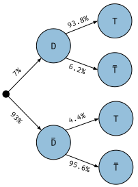
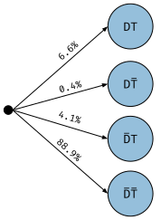

The [Kullback-Liebler
divergence](https://en.wikipedia.org/wiki/Kullback%E2%80%93Leibler_divergence),
or KL divergence, or relative entropy, or relative information, or information
gain, or expected weight of evidence, or information divergence 
(it goes by a lot of different names) is unique
amongst the ways to measure the difference between two probability
distributions.  It holds a special and privileged place, being used to define
all of the core concepts in information theory, such as mutual information.

Why is the relative information so special and where does it come from? 
How should you interpret it? What is a nat anyway?  What does that mean?  In this
note, I'll try to give a better understanding and set of intuitions about
what KL is, why its interesting, where it comes from and what its good for.

## Information Gain

Imagine we have some prior set of beliefs.  In light of some kind of evidence, 
we update our beliefs.  How *much* did we update our beliefs?  How do we quantify
the *magnitude* of that update?  What are some properties we might want this 
hypothetical function to have?  Let's denote $I[p; q]$ the function that measures
the information required for the move from beliefs $q$ to $p$. <a href="#hobson">1</a>

<aside> 1 
  What follows is my own reconstruction of the fabulous paper: 
  <a href="https://link.springer.com/article/10.1007/BF01106578">
  <b>A New Theorem of Information Theory</b> by Arthur Hobson
  </a>.
</aside>

We want our information function to satisfy the following properties:
  
  1. Its **continuous**.  A small change in the distributions makes a small change in the amount of information in the move.
  2. It's permutation or **reparameterization independent**.  It doesn't matter if we change the units we've specified our distributions in or if we relabel the sides of our dice.
  3. We want it to be **positive** and have the value $I = 0$ if and only if $p = q$.
  4. We want it to be **monotonic** in a natural sense.  If we, for instance start with some uniform distribution over the 24 people in a game of [Guess Who?](https://en.wikipedia.org/wiki/Guess_Who%3F) and then update to only 5 remaining suspects, $I$ should be larger than if there were still 12 remaining suspects.
  5. Finally we want our information function to **decompose** in a natural and **linear** way.<a href="#renyi">xx</a>

<aside> 2
  If one relaxes the requirement for linear decomposition and instead just requires that our information
  function decompose in a convex way, you get the generalized set of 
  <a href="https://en.wikipedia.org/wiki/R%C3%A9nyi_entropy#R%C3%A9nyi_divergence">Rényi divergences</a>.
  See: <a href="https://projecteuclid.org/euclid.bsmsp/1200512181">
  <i>On Measures of Entropy and Information</i> by Alfréd Rényi.</a>
</aside>

These are all very natural properties for our information function to have.  That last point about composition needs to be elaborated.
The point is that we have alternative ways we might express a probability distribution.  Apropos of nothing, imagine we 
are concerned that we might have been exposed to a disease and are thinking about getting a test done.  There are two random variables
under consideration, we will label them $\mathcal{D}$ for whether we actually had the disease or not, 
and $\mathcal{T}$ for whether
the test result is positive.  Each of these random variables can take on two possible states, we'll denote them as
$\mathcal{D} \in \{ D, \overline D \}, \mathcal{T} \in \{ T, \overline T \}$.
$D$ represents the state of our having-had-the-disease random variable $\mathcal{D}$ being positive, meaning we actually
did have the disease.  $\overline D$ denotes we actually didn't.
With two binary random variables, there are 4 possible outcomes $(\{ DT, D\overline T, \overline D T, \overline D \overline T\})$
and fully specifying our set of beliefs requires 3 independent probabilities.

<aside> xx
  An &ldquo;<i>Almost Certainly Not</i>&rdquo; is 7% on
  the <a href="https://en.wikipedia.org/wiki/Words_of_estimative_probability">Kent's words of Estimative Probability</a> list.
</aside>
<aside> xx
  See for instance the RDT Cellex Inc. <a href="https://www.centerforhealthsecurity.org/resources/COVID-19/serology/Serology-based-tests-for-COVID-19.html">SARS-COV-2 Test</a>.
</aside>

What our our prior beliefs?
Let's imagine while we are concerned we might have had the disease, but if we are being honest, 
we almost certainly didn't,<a href="#kent">xx</a>
so we'll put our prior belief in having had the disease at 7%. $(q(D) = 0.07)$.
How do we expect the antibody test to go if we have it done?
You do a bit of research and discover
that if you had had the disease, the sensitivity or *true positive rate* of the
test you're about to take is 93.8% $(q(T|D) = 0.938)$.
The specificity or *true negative rate* of that
same test is 95.6% $(q(\overline T | \overline D) = 0.956)$. <a href="#covid">xx</a> 

<figure id="#conditional" class="right">
  

  
  
  <figcaption>
  Figure xx. Two equivalent ways to express the joint distribution $q(\mathcal{D}\mathcal{T})$.
  </figcaption>
  

</figure>
We've just specified our prior beliefs with 3 numbers, imagining our process as having two steps,
first we either had the disease or not $(q(\mathcal{D}))$ and then, conditioned on that
we get the result of our test $(q(\mathcal{T}|\mathcal{D}))$.  
Equivalently, we could have just given the joint probability distribution, as shown in Figure xx.

The point now is that if we were to update our beliefs, in the diagram on the right there is just a single 
distribution $q(\mathcal{T},\mathcal{D})$, in the one on the left there are essentially three different distributions 
$(q(\mathcal{D}), q(\mathcal{T}|D), q(\mathcal{T}| \overline D))$ and we want
some sort of *structural* constitency between the two sides:
$$
I[p(\mathcal{D}\mathcal{T}); q(\mathcal{D}\mathcal{T})] \quad \textrm{versus} \quad
I[p(\mathcal{D}); q(\mathcal{D})], I[p(\mathcal{T}|D); q(\mathcal{T}|D)],
I[p(\mathcal{T}|\overline D), q(\mathcal{T}|\overline D)] . 
$$

The consistenty we will require is that our information measure decomposes linearly between
these two different descriptions. The information between the joints should be a weighted 
linear combination of the informations of three constituent distributions.
In this particular case we will require:
$$ I[p(\mathcal{D}\mathcal{T}); q(\mathcal{D}\mathcal{T})] =  I[p(\mathcal{D}); q(\mathcal{D})] + p(D) I[p(\mathcal{T}|D); q(\mathcal{T}|D)] + p(\overline D) I[p(\mathcal{T}|\overline D), q(\mathcal{T}|\overline D)] .
$$
In words: The information in the full joint update is the information update for
your belief in whether or not you had the disease $(q(\mathcal D))$ *plus* the informations
in the two conditional distributions, but weighted by how often we find ourselves in each of those
branches, as measured by our updated beliefs $(p(\mathcal{D}))$.

More generally we are requiring that our information function satisfies a natural *chain rule*:
$$ I[ p(X,Y); q(X,Y) ] = I[ p(X); q(X) ] + \mathbb{E}_{p(X)} \left[ I[ p(Y|X); q(Y|X) ] \right] $$

Notice that it is here, in this sort of structural independence that we make our information function manifestly asymmetric. Here our $p$ 
distribution becomes distinguished over our $q$ as it is the one we use to weight the child informations.  This makes sense if we imagine or if
$p$ is the actual distribution that events are drawn from, for it means that this will correspond to the informations we would observe
in expectation.  

The interesting thing is that if you want your information function to satisfy all of these seemingly reasonable properties, that is
enough to determine it *uniquely*.  The only function satisfying all of these properties is the relative entropy, or KL divergence we
all know and love:
$$
  I[p;q] = \int dx\, p(x) \log \frac{p(x)}{q(x)}
$$

See <a href="https://link.springer.com/article/10.1007/BF01106578">
<b>A New Theorem of Information Theory</b> by Arthur Hobson
</a> for a complete proof,
but here I'll offer a more colloquial argument that one
given by Ariel Caticha.<a href="#caticha">2</a>  

<aside> 2
  <i>Lectures on Probability, Entropy and Statistcal Physics</i> by
  Ariel Caticha. <a href="https://arxiv.org/abs/0808.0012">arXiv:0808.0012</a>
</aside>

We will start with and focus on the continuous setting, where we have two probability 
distributions $p$ and $q$.  We seek a functional that takes our two distributions
and gives back our information gain and we seek one that is *local* in the physics sense, 
meaning that our *functional* can be written as the integral of a *function* depending
only on the values the probability densities take at each point:
$$ I[p;q] = \int dx\, \mathcal{A}(x, p(x), q(x)). $$

Our requirement that our information gain be
*reparameterization independent* means it has to
be invariant to any remapping of our coordinates, or in other words,
it has to be dimensionless.  Imagine $x$ has units of a length, here our integral
measure $dx$ has units of a length, and the densities $p(x), q(x)$ would 
have units of an inverse length.  In order to be dimensionally consistent
our functional must take the form:<a href="#caveat">3</a>
$$ I[p;q] = \int dx\, p(x) f\left( \frac{p(x)}{q(x)} \right). $$

<aside> 3
  We could have just as well written it as $I[p;q] = \int dx\, q(x) g\left( \frac{p(x)}{q(x)} \right)$ (that is, the form
  of an <a href="https://en.wikipedia.org/wiki/F-divergence">f-divergence</a>), but 
  this is equivalent to the way we wrote it with $f(\mathcal{X}) = \mathcal{X} g(\mathcal X)$.
  Putting the $p(x)$ as the integral measure better aligns with what we are about to do next.
</aside>

Finally, our decomposability requirement above when written out in terms of
continuous densities takes the form:
$$ I[ p(x,y); q(x,y) ] = I[ p(x); q(x) ] + \int dx\, p(x) I[p(y|x) ; q(y|x)] $$
  
Combining this linear decomposition requirement with our requirement for the
form required and pushing some equations around gives us:
$$
\begin{align}
  I[ p(x,y); q(x,y) ] &= I[p(x); q(x)] + \int dx\, p(x) I[p(y|x); q(y|x)] \\
  \int dx\, dy\, p(x,y) f\left(\frac{p(x,y)}{q(x,y)} \right)&= \int dx\, p(x) f\left(\frac{p(x)}{q(x)} \right) + \int dx\, p(x) \int dy\, p(y|x) f\left(\frac{p(y|x)}{q(y|x)} \right) \\
  \int dx\, dy\, p(x) p(y|x) f\left(\frac{p(x)p(y|x)}{q(x)q(y|x)} \right)&= \int dx\, dy\, p(x) p(y|x) \left[ f\left(\frac{p(x)}{q(x)} \right) + f\left(\frac{p(y|x)}{q(y|x)} \right)\right] .
\end{align}
$$
Notice that this demonstrates that our function $f$ must satisfy the property:
$$ f(ab) = f(a) + f(b). $$
This well known functional equation has a unique (up to a multiplicative constant) *continuous* solution:
$$ f(x) = c \log x. $$
We can roll the choice of multiplicative constant into our choice of basis for the logarithm and arrive at our final form
for our information gain:
$$ I[p;q] = \int dx\, p(x) \log \frac{p(x)}{q(x)}. $$

## Bayes Rule

<aside> xx
  I first saw this form of motivation for Bayes Rule in
  <i>Lectures on Probability, Entropy and Statistcal Physics</i> by
  Ariel Caticha. <a href="https://arxiv.org/abs/0808.0012">arXiv:0808.0012</a>
</aside>
Having identified the right way to measure how much information is gained when we update a distribution
from $q$ to $p$, why don't we put this to practical use and try to figure out how we 
<i>ought</i> to update
our beliefs in light of evidence or observations.<a href="#caticha2">xx</a>

Returning to our disease testing example, let's say you get the test done and receive a positive result.
What should your new distribution of beliefs be? Well, first off if we've observed the results of the test
we should probably have our updated beliefs reflect the observation we made, making it consistent with our
observation, setting $p(T) = 1$, but this doesn't fully specify $p$ we need two more numbers.  How should
we set those?

Why don't we aim to be conservative and try to find the new set of beliefs
that are as close as possible to our prior beliefs while still being consistent with the
observation that we've made.  
Namely, let's look now for a joint distribution $p(\mathcal T, \mathcal D)$ 
that is as close as possible to $q(\mathcal T, \mathcal D)$ but for which we have that $p(T)=1$.
Now that we know
how to measure how much information is gained in updating our beliefs, we will
find the $p$ that minimizes this update while still being true to the observation we made.
Writing $p(\mathcal D,\mathcal T) = p(\mathcal T)p(\mathcal D|\mathcal T)$ 
and using our linear decomposition rule from above (the other way around), we have:
$$ I[p(\mathcal D,\mathcal T); q(\mathcal D,\mathcal T)] = I[p(\mathcal T);q(\mathcal T)] + I[p(\mathcal D|T);q(\mathcal D|T)]. $$
Because we've decided to peg $p(T)=1$ in order to be consistent with our 
observation, the way to minimize the information between the joints is to set $p(\mathcal D|T)=q(\mathcal D|T)$ so
that our second term vanishes, in this particular case this means:
$$ p(T)=1 $$ 
$$ p(D|T) = q(D|T) = \frac{q(T|D)q(D)}{q(T|D)q(D) + q(T|\overline D)q(\overline D)} = 0.616 $$

Furthermore, the marginal distribution of our updated beliefs about our disease status is:
$$ p(D) = p(D|T)p(T) = q(D|T) = 0.616$$
In this particular case our updated belief is only 3 to 2 on 
that we actually had the disease, despite our positive test result. In Figure xx 
we show both our prior in this factorization as well as our new beliefs.
<figure id="#posterior" class="right">
  

  
  
  <figcaption>
  Figure xx. Our prior (left, blue, notice that we've swapped the order of the conditioning) and updated (right, orange) beliefs after observing that the test was positive.
  </figcaption>
  

</figure>

Notice what just happened.  If we look for a new distribution that is as close as possible
to our previous distribution of beliefs (as measured by $I[p;q]$) which is also consistent
with our observations, we end up with an updated, or *posterior* set of beliefs given
by Bayes' Rule.  Imagine we had some observable $x$ and some parameters $\theta$.  Our
prior set of beliefs are described by the joint distribution $q(\theta,x) = q(x|\theta)q(\theta)$:
a *likelihood* $q(x|\theta)$ of how we expect the data to be distributed given
the parameter values and some *prior* $q(\theta)$ set of beliefs about what values
those parameters can take.  If we make an observation and see some value for our observable $x=X$, 
what ought our new beliefs be?  If we search for the joint distribution $p(x,\theta)$ that is
as close as possible to our previous beliefs $q(x,\theta)$ but that no longer has any
uncertainty about the value the observable will take $(p(x) = \delta(x-X))$ we see
that minimizing the information gain:
$$ I[p;q] = I[p(x);q(x)] + \int dx\, p(x) \, I[p(\theta|x); q(\theta|x)], $$
is accomplished if we set $p(\theta|x) = q(\theta|x)$, yielding the updated joint:
$$ p(x,\theta) = p(x)p(\theta|x) = \delta(x-X) q(\theta|x) $$
and the marginal beliefs about the parameters to be:
$$ p(\theta) = \int dx\, p(x,\theta) = \int dx\, \delta(x-X) q(\theta|x) = q(\theta|X), $$
or precisely what you probably thought it should have been anyway if you've heard
of Bayesian inference.

Although, if you stop to think about it, even though many of us know of and have
used <a href="https://en.wikipedia.org/wiki/Bayes%27_theorem">Bayes Theorem</a> 
for a long time, the way its normally presented, it is just a trivial statement
about how joint distributions factor.
$$ q(\theta, D) = q(\theta) q(D|\theta) = q(D) q(\theta|D)  \implies
 q(\theta|D) = \frac{q(D|\theta) q(\theta)}{q(D)}. $$
But, this is just a statement about distribution
$q$, our prior beliefs.  It tells us nothing about how we should update those
beliefs in light of observations.  However, the previous argument demonstrates
that if you want to set your updated beliefs such that they are as close
as possible to your prior beliefs while being consistent with your 
observations, you should set your updated beliefs according to
Bayes rule run on the prior beliefs.

## Interpretations

We have just seen how we can motivate the relative entropy as the *information gain* when we move from
one distribution to another.  Can we develop a better intuition for the actual value the KL takes?  

### Coding

Let's start with a coding perspective.  Imagine we have a simple 4-letter
alphabet that we want to communicate over the wire. 
If the four letter occurred with different probabilities:
$p(A)=1/2, p(B)=1/4, p(C)=p(D)=1/8$, with an optimally designed <a
href="https://en.wikipedia.org/wiki/Huffman_coding">Huffman Code</a> we could
encode our letters with a variable length code: $A:0, B:10, C:110, D:111$, and
on average we'd only be spending $1/2 + 2/4 + 3/8 + 3/8 = 7/4$ bits per letter.

<figure>
  

  <table>
    <thead><th><th>A<th>B<th>C<th>D
    <tr><td>$p$<td>1/2<td>1/4<td>1/8<td>1/8
    <tr><td>p-code<td>0<td>10<td>110<td>111
    <tr><td>$q$<td>1/4<td>1/4<td>1/4<td>1/4
    <tr><td>q-code<td>00<td>01<td>10<td>11
  </table>
  <figcaption>
    Table 2: A simple example of two different distributions over a 4 letter alphabet.
  </figcaption>
  

</figure>

Imagine however we didn't know what the true distribution of letters were and instead
designed an optimal code using a different distribution $q$.  If we believed
each of the 4 letters were equally likely $(q(A)=q(B)=q(C)=q(D)=1/4)$, the optimal way to 
encode messages would just assign a two bit code to each letter $(A : 00, B:01, C:10,
D:11)$.  If we used this suboptimal code to send messages that were actually distributed
as $p$ it would cost $2/2 + 2/4 + 2/8 + 2/8 = 2$ bits per letter.  Our incorrect
belief leads to a $2 - 7/4 = 1/4$ of a bit inefficiency.  For these two distributions,
it shouldn't come as a suprise that the information gain is precisely 1/4 bits:
$$ I[p;q] = \sum_i p_i \log_2 \frac{p_i}{q_i} = 1/4 \textrm{ bits}. $$

For an optimally designed code, the code lengths go as $-\log p(x)$ for any symbol $x$.
Our information gain can be interpreted as a difference in expected code lengths under $p$:
$$ I[p;q] = \mathbb{E}_p[ -\log q ] - \mathbb{E}_p[-\log p ]. $$
The information gain $I[p;q]$ measures the *excess encoding cost* for trying to encode messages
from $p$ using a code designed for $q$.

### Expected Weight of Evidence

Above we saw that we can motivate Bayesian inference as choosing a posterior belief distribution
that has the minimal information gain over our prior distribution of beliefs while being consistent
with our observations.  This guides us towards forming better belief distributions, but what if we 
just have two different belief distributions and wish to decide between them? 

Really what we want to know is what is the probability that our beliefs are correct in light of evidence?
Symbolically you might write this as $p(P|E)$ where $P$ is some belief distribution $P$ and $E$ is some
evidence, data or observations. If we run Bayes Theorem we can see that:
$$ p(P|E) = \frac{p(E|P) p(P)}{p(E)}. $$
We can update our belief in our beliefs being correct by setting our updated
weight in the belief $p(P|E)$ to be proportional to our initial weight $p(E)$ times
the *likelihood* that the evidence we observed would have been generated if our belief was true $(p(E|P))$.
Proportional because we would need to know how likely the evidence would be $p(E)$ amongst all possible
beliefs.  This last part, the <a href="https://en.wikipedia.org/wiki/Marginal_likelihood"><i>marginal likelihood</i></a>
is notoriously difficult to compute. In principle it is asking us to evaluate how likely
the evidence would be from all possible models.  

However, we can make further progress if we content ourselfs to not necessarily knowing the 
absolute probability our model or beliefs are correct, but instead just its probability relative
to some other model.  If we consider the ratio of two different models $P$ and $Q$ we have:
$$ \frac{p(P|E)}{p(Q|E)} = \frac{p(E|P)}{p(E|Q)} \frac{p(P)}{p(Q)}. $$
Notice that the marginal likelihoods cancel out.  This is saying that whatever prior relative odds for the two models
being correct, if we compute the <a href="https://en.wikipedia.org/wiki/Bayes_factor"><i>Bayes factor</i></a> 
$\left( \frac{p(E|P)}{p(E|Q)} \right)$, it tells us how the relative probabilities of the two beliefs should update
inlight of the evidence. Taking a log on both sides:
$$ \log \frac{p(P|E)}{p(Q|E)} = \log \frac{p(E|P)}{p(E|Q)} + \log \frac{p(P)}{p(Q)},$$
turns this multiplicative factor into an additive one.

If what we are deciding between is two different probability distributions, you may recognize that this additive <i>weight of evidence</i>
for $p$ over $q$ when we observe $x$ is precisely the integrand in our information gain:
$$ w[x; p,q] =  \log \frac{p(x)}{q(x)}. $$
The log ratio of two probability distributions measures by how much you should update your prior log odds between the two distributions being
correct.  The KL divergence is just then the expected weight of evidence if we draw samples from $p(x)$ itself:
$$ I[p;q] = \mathbb{E}_p\left[ \log \frac{p(x)}{q(x)} \right] = \mathbb{E}_p \left[ w[x; p,q] \right]$$

## How loud is the Evidence?

Our measurement of the amount of information was only unique up to a choice of multiplicative constant.  This is equivalent to
our choice of base for the logarithm.  We can think of this as the *units* we use to measure our information.  The traditional choices
would be to use the base-2 logarithm and measure the information in *bits*,<a href="#bit">xx</a>
or to use the more mathematically convenient natural
logarithm and measure the information in *nats*.  Another option is to measure the information in
<a href="https://en.wikipedia.org/wiki/Hartley_(unit)">*decibans*</a> or *decibels* or *Hartley's*, wherein
we use ten times the base-10 logarithm.
<aside> xx
 <i>bit</i> being short for <i>binary digit</i>.  
 <i>nat</i> is then short for <i>natural digit</i>.
 People sometimes suggest <i>dit</i> for the base-10 </i>decimal digit</i>.
 Turing suggested *ban* as short hand for the amount of evidence deduced about the setting 
 of the Enigma machine using the Banburismus method, itself named after the town of Banbury where
 the team got their large card sheets used in the method.
 For more discussion about the history and etymology of these and related units see section 4.8.1 of
 <a href="https://books.google.com/books/about/Probability_Theory.html?id=tTN4HuUNXjgC&source=kp_book_description"><i>Probability Theory: The Logic of Science</i> by E.T. Jaynes</a>.
</aside>
$$ I[p;q] = 10 \int dx\, p(x) \log_{10} \frac{p(x)}{q(x)}\, \textrm{dB} $$

The nice thing about measuring information in decibans or <a href="https://en.wikipedia.org/wiki/Decibel">decibels</a> 
is the people already have some familiarity with the unit, such as for measuring the *loudness* of sounds. 
Its always a comparative measurement, for sound taking $10 \log_{10} \frac{P}{P_0}$ of the power
to some reference or baseline power.  In the same way we could besides just measuring the KL between two distributions,
measure the comparative difference between any two probabilities on the log scale:
$$ 10 \log_{10} \frac{p(x)}{q(x)} \textrm{ dB}. $$

Secondly that it seems like 1 dB roughly corresponds the smallest detectable value that people
notice in terms of a change in underlying distribution, being the difference between <i>even chance</i>
and <i>moderate probability</i> or <i>better than even chance</i>.

<aside id="quantifying">xx 
  <a href="https://projecteuclid.org/euclid.ss/1177012242"><i>Quantifying Probabilistic Expressions</i> by
  Frederick Mosteller and Cleo Youtz</a>.
</aside>
Additionally, $10 \textrm{ dB}$ corresponds to 10 to 1 odds, or 91% probability, which people associate
with events being <i>almost certain</i> or happening <i>almost always</i>. <a href="#quantifying">xx</a>.

We have the conversions:
$$ 1 \textrm{ nat} = \frac{10}{\log 10} \textrm{ dB} = 4.34 \textrm{ dB} $$
$$ 1 \textrm{ bit} = \frac{10}{\log_2 10} \textrm{ dB} = 3.01 \textrm{ dB} $$

Below in Table 1 is a summary of the correspondence between decibans and odds or probabilities, and
in Figure xx is a large visual representation you can play with.
<figure>

<table>
  <thead><th>db<th>odds<th>~odds<th>probability<th>spinner
  <tr><td>0<td>1.00<td>1:1<td> 50% 
    <td><svg height="30" width="30" viewBox="0 0 20 20"> <circle r="10" cx="10" cy="10" fill="white" /> <circle r="5" cx="10" cy="10" fill="whitesmoke" id="progress-0" stroke="#1f77b4" stroke-width="10" stroke-dasharray="0.942 2.200" /></svg>
  <tr><td>1<td>1.26<td>5:4<td>56%
    <td><svg height="30" width="30" viewBox="0 0 20 20"> <circle r="10" cx="10" cy="10" fill="white" /> <circle r="5" cx="10" cy="10" fill="whitesmoke" id="progress-1" stroke="#1f77b4" stroke-width="10" stroke-dasharray="0.942 2.200" /></svg>
  <tr><td>2<td>1.58<td>3:2<td>61%
    <td><svg height="30" width="30" viewBox="0 0 20 20"> <circle r="10" cx="10" cy="10" fill="white" /> <circle r="5" cx="10" cy="10" fill="whitesmoke" id="progress-2" stroke="#1f77b4" stroke-width="10" stroke-dasharray="0.942 2.200" /></svg>
  <tr><td>3<td>2.00<td>2:1<td>67%
    <td><svg height="30" width="30" viewBox="0 0 20 20"> <circle r="10" cx="10" cy="10" fill="white" /> <circle r="5" cx="10" cy="10" fill="whitesmoke" id="progress-3" stroke="#1f77b4" stroke-width="10" stroke-dasharray="0.942 2.200" /></svg>
  <tr><td>4<td>2.51<td>5:2<td>71.5%
    <td><svg height="30" width="30" viewBox="0 0 20 20"> <circle r="10" cx="10" cy="10" fill="white" /> <circle r="5" cx="10" cy="10" fill="whitesmoke" id="progress-4" stroke="#1f77b4" stroke-width="10" stroke-dasharray="0.942 2.200" /></svg>
  <tr><td>5<td>2.16<td>3:1<td>76%
    <td><svg height="30" width="30" viewBox="0 0 20 20"> <circle r="10" cx="10" cy="10" fill="white" /> <circle r="5" cx="10" cy="10" fill="whitesmoke" id="progress-5" stroke="#1f77b4" stroke-width="10" stroke-dasharray="0.942 2.200" /></svg>
  <tr><td>6<td>3.98<td>4:1<td>80%
    <td><svg height="30" width="30" viewBox="0 0 20 20"> <circle r="10" cx="10" cy="10" fill="white" /> <circle r="5" cx="10" cy="10" fill="whitesmoke" id="progress-6" stroke="#1f77b4" stroke-width="10" stroke-dasharray="0.942 2.200" /></svg>
  <tr><td>7<td>6.31<td>5:1<td>86%
    <td><svg height="30" width="30" viewBox="0 0 20 20"> <circle r="10" cx="10" cy="10" fill="white" /> <circle r="5" cx="10" cy="10" fill="whitesmoke" id="progress-7" stroke="#1f77b4" stroke-width="10" stroke-dasharray="0.942 2.200" /></svg>
  <tr><td>8<td>7.94<td>6:1<td>89%
    <td><svg height="30" width="30" viewBox="0 0 20 20"> <circle r="10" cx="10" cy="10" fill="white" /> <circle r="5" cx="10" cy="10" fill="whitesmoke" id="progress-8" stroke="#1f77b4" stroke-width="10" stroke-dasharray="0.942 2.200" /></svg>
  <tr><td>9<td>7.94<td>8:1<td>89%
    <td><svg height="30" width="30" viewBox="0 0 20 20"> <circle r="10" cx="10" cy="10" fill="white" /> <circle r="5" cx="10" cy="10" fill="whitesmoke" id="progress-9" stroke="#1f77b4" stroke-width="10" stroke-dasharray="0.942 2.200" /></svg>
  <tr><td>10<td>10<td>10:1<td>91%
    <td><svg height="30" width="30" viewBox="0 0 20 20"> <circle r="10" cx="10" cy="10" fill="white" /> <circle r="5" cx="10" cy="10" fill="whitesmoke" id="progress-10" stroke="#1f77b4" stroke-width="10" stroke-dasharray="0.942 2.200" /></svg>
</table>

  <figcaption>
    Table 1: A table of the correspondence between decibans/decibels and odds or probabilities.
  </figcaption>
</figure>

<figure id="bigspin">
  

   <svg height="300" width="300" viewBox="-2 -2 25 25"> <circle r="10" cx="10" cy="10" fill="white" stroke="black" stroke-width=0.2 /> <circle r="5" cx="10" cy="10" fill="whitesmoke" id="progress-11" stroke="#1f77b4" stroke-width="10" stroke-dasharray="3.141 3.141" /></svg>
    
   <input value=0 type='number' style="width: 4em" id="percent" onchange="updatePercent();">
   <label for="percent">dB</label>
    
   <input id="slider" style="width: 65%;" type="range" min="-23" step="0.1" max="23" value="0" class="slider" id="slider"
   oninput="updateSlider();" >
  <figcaption>Figure xx: A larger visual representation of decibels as a probability that you can play with. Here the set value
  of decibels measure the weight of evidence between the spinner giving a blue versus a white outcome.</figcaption>
  

</figure>

A ban seems to correspond to the Kent's Estimative Probability of something being
"almost certain".

## Examples and Magnitudes

## Whither Continuous Entropy

The relative entropy really is the proper way to define entropy.  For all
of the things that Shannon got right, he flubbed a bit when he defined the
entropy of a distribution as:
$$ H(P) = -\sum_i p_i \log p_i $$

Why do I say he flubbed?  Because this notion of entropy doesn't generalize
to continuous distributions.  The continuous analog:
$$ H(P) = -\int dx\, p(x) \log p(x) $$
isn't *reparameterization independent*.  Consider for instance the distribution
of adult human heights: <a href="#bimodal">3</a> 
<figure>
  

  
  <figcaption>Figure 1. Distribution of adult heights. <a href="#ourworld">3</a></figcaption>
  

</figure>

<aside> 2
  Note that you may have heard that 
  <a href="https://www.johndcook.com/blog/2008/07/20/why-heights-are-normally-distributed/">heights are normally distributed</a>.
  Adult male (or female) heights are normally distributed, but differ in their means and variances, making the 
  <a href="https://www.johndcook.com/blog/2008/11/25/distribution-of-adult-heights/">distribution of adult heights a mixture distribution</a>.
</aside>

<aside> 3
  Data taken from 
  <a href="https://ourworldindata.org/human-height">ourworldindata.org</a>.
</aside>

If you measure the continuous entropy of this distribution measured
in centimeters you get 5.4 bits.  If you instead measure the entropy
of the same distribution in feet you get 4 bits.  If you instead
were to measure heights in meters it would be -1.3 bits! <a href="#negative">4</a>

<aside> 4
  It seems strange to have a negative entropy, but in this case it is basically
  reflecting the fact that in terms of meters, the human height distribution doesn't
  span a whole meter in breadth, so it actually takes fewer *relative* bits
  to specify a human height in meters than it would take to specify any
  quantity in meters, because its uncertainty is less than a whole meter.
</aside>

