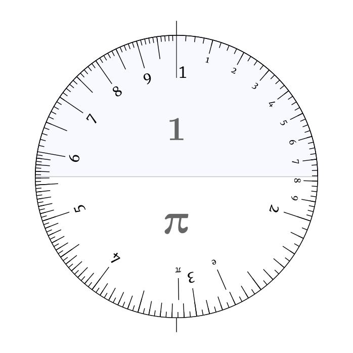
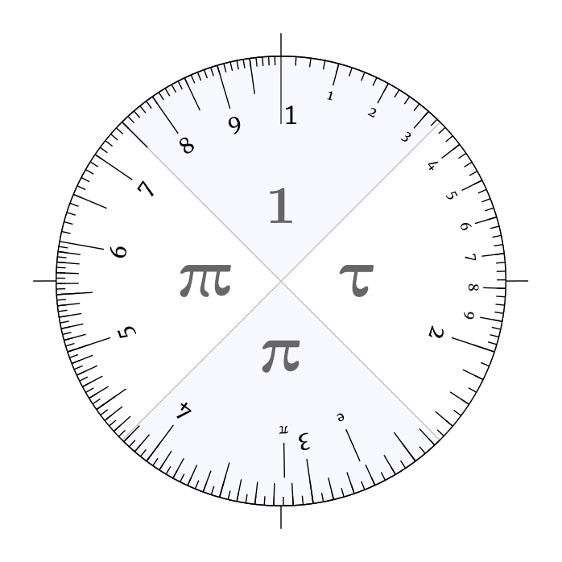
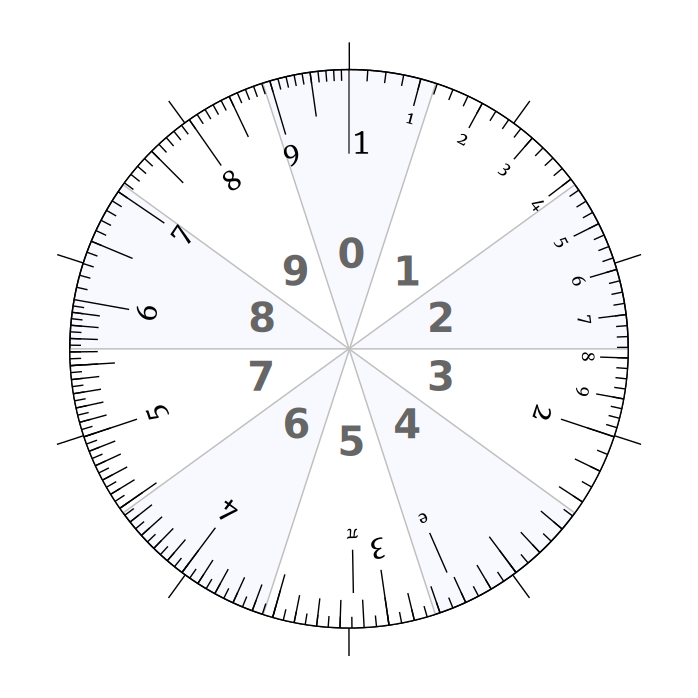

Let's tour some fun ways to do mental math to various precisions.

I like doing order of magnitude problems, so own a wide array of books on the subject, including books full of fun estimation problems.  One of the books I own is <a href="https://www.amazon.com/Maths-Back-Envelope-calculate-anything/dp/0008324581">Maths On The Back Of An Envelope</a> by Rob Eastaway.  In it, he suggests a form of estimation he brands <a href="https://www.theguardian.com/science/alexs-adventures-in-numberland/2013/apr/04/zequals-symbol-sums-mathematics">zequals</a>, i.e. you round numbers to only a single significant digit and do your calculation that way.<a href="#frontend">1</a><a href="#numberphile">2</a>  This form of "ruthless" approximation is meant to make it easy to do mental arithmetic.

<aside>1 
 Trying to find other sources, I'm finding educational resources that refer to this as "front-end estimation", e.g. <a href="https://study.com/academy/lesson/how-to-use-front-end-estimation.html#:~:text=all%20other%20digits.-,Estimation%20is%20finding%20an%20approximate%20value%20for%20a%20calculation%2C%20called,Calculate%20using%20the%20rounded%20values.">here</a>.
</aside>

<aside>2
It also featured in an old <a href="https://youtu.be/aOJOfh2_4PE?si=npC8b4px-B2XwHM1">Numberphile</a> video.
</aside>

The branding is cute. I think trying to round things to a single significant digit is something people tend to do pretty naturally when they are estimating.  However, thinking about it again, I think there is a neat way to get the same or better precision with even less of the fuss.  We should use quarter orders of magnitude.  Let's build up to that.

## Order of Magnitude

When you get into <a href="https://en.wikipedia.org/wiki/Fermi_problem">Fermi problems</a> you often start by simply tracking the orders of magnitude, i.e. you round every number to its nearest power of 10 and only keep track of those.  This makes for very speedy estimates, but the resolution is obviously only good to about an order of magnitude.  This works great for trying to answer questions like my son asked the other day: "If we suddenly got an extra electron on each of our atoms, what would happen?"<a href="#electrons">3</a>

<aside>3 
We can estimate the sudden energy increase: $\frac{ke\frac{200\text{ lbs}}{16\text{ g/mol}}\times N_A}{3\text{ ft}} \sim 10^{27}\text{ J}$. Or 10 times the energy the sun releases in a second, similar to the energy that would be released if the moon hit the earth. For lots of other fun problems like this, see <a href="https://what-if.xkcd.com/">what-if?</a>.
</aside>

We don't really care about accuracy that is better than a factor of 10, we are more interested if it would be like a punch to the gut, a bomb going off or armageddon.  Order of magnitude math is good for this kind of thing, and easy to do mentally or on paper.  You only need to track the powers of 10.  Multiplication and division become as easy as addition and subtraction:

$$ 10^a 10^b / 10^c = 10^{a + b - c}. $$

## One - Few - Ten

Quickly though, you find yourself wanting to go beyond just order of magnitude math.  A natural next step would be to use half-orders-of-magnitude.  Now, instead of rounding each number to the nearest power of 10, you round each number to the nearest half-power of 10.  This sounds like it might be complicated but ends up being very simple in practice.

<figure id="half">
  

  
  <figcaption>
  Figure xxf-half. Half orders of magnitude.
  </figcaption>
  

</figure>

When you play with slide rules, you quickly really internalize how close $\pi$ is to the square root of 10.

$$ \sqrt{10} = 10^{\frac 12} \approx 3.18 \approx 3.14 \approx \pi $$

So, in practice you simply round each number to either the nearest power of 10 or $\pi$ times the nearest power of 10.

For example:
$$
\begin{align*}
1.0 &\rightarrow 1 \\
1.2 &\rightarrow 1 \\
151.23 &\rightarrow 100 \\
42,000 &\rightarrow \pi \times 10^4 \\
0.0723 &\rightarrow 0.1 \\
40 &\rightarrow \pi \times 10.
\end{align*}
$$

Looking at the Logarithmic circular dial above, the precise rounding points are $10^{1/4} \approx 1.78$ and $10^{3/4} \approx 5.6$, which at the level of precision we are dealing with you could call 2 and 6.  To use the One-Few-Ten system then, if the first digit of a number is between 2 and 6, you call it $\pi$ times the relevant power of 10, and otherwise you just round it to the nearest power of 10.  Two pis make another ten: $\pi^2 \approx 10$.   The 'arithmetic' is quite simple:

<figure id="pi-table">

    <table>
        <thead><tr><td></td>
            <td>$1$</td><td>$\pi$</td>
        </tr></thead>
        <tbody>
        <tr><td>$1$</td>
            <td>$1$</td><td>$\pi$</td>
        </tr>
        <tr><td>$\pi$</td>
            <td>$\pi$</td><td>$10$</td>
        </tr>
        </tbody>
    </table>
  <figcaption>
  Figure xxf-halftable. Half-orders-of-magnitude multiplication table.
  </figcaption>

</figure>

So, this doesn't really add any sort of mental burden, but increases our accuracy from being good to only an order of magnitude or factor of 10, to being good to a factor of $\pi$. 

## One Significant Digit

This brings us back to Eastman's *zequals*, or one-signficant-digit arithmetic.  The full multiplication table is a lot more complicated:  

    <table>
        <thead><tr><td></td>
            <td>$1$</td><td>$2$</td><td>$3$</td><td>$4$</td><td>$5$</td><td>$6$</td><td>$7$</td><td>$8$</td><td>$9$</td>
        </tr></thead>
        <tbody>
        <tr><td>$1$</td>
            <td>$1$</td><td>$2$</td><td>$3$</td><td>$4$</td><td>$5$</td><td>$6$</td><td>$7$</td><td>$8$</td><td>$9$</td>
        </tr>
        <tr><td>$2$</td>
            <td>$2$</td><td>$4$</td><td>$6$</td><td>$8$</td><td>$10$</td><td>$12$</td><td>$14$</td><td>$16$</td><td>$18$</td>
        </tr>
        <tr><td>$3$</td>
            <td>$3$</td><td>$6$</td><td>$9$</td><td>$12$</td><td>$15$</td><td>$18$</td><td>$21$</td><td>$24$</td><td>$27$</td>
        </tr>
        <tr><td>$4$</td>
            <td>$4$</td><td>$8$</td><td>$12$</td><td>$16$</td><td>$20$</td><td>$24$</td><td>$28$</td><td>$32$</td><td>$36$</td>
        </tr>
        <tr><td>$5$</td>
            <td>$5$</td><td>$10$</td><td>$15$</td><td>$20$</td><td>$25$</td><td>$30$</td><td>$35$</td><td>$40$</td><td>$45$</td>
        </tr>
        <tr><td>$6$</td>
            <td>$6$</td><td>$12$</td><td>$18$</td><td>$24$</td><td>$30$</td><td>$36$</td><td>$42$</td><td>$48$</td><td>$54$</td>
        </tr>
        <tr><td>$7$</td>
            <td>$7$</td><td>$14$</td><td>$21$</td><td>$28$</td><td>$35$</td><td>$42$</td><td>$49$</td><td>$56$</td><td>$63$</td>
        </tr>
        <tr><td>$8$</td>
            <td>$8$</td><td>$16$</td><td>$24$</td><td>$32$</td><td>$40$</td><td>$48$</td><td>$56$</td><td>$64$</td><td>$72$</td>
        </tr>
        <tr><td>$9$</td>
            <td>$9$</td><td>$18$</td><td>$27$</td><td>$36$</td><td>$45$</td><td>$54$</td><td>$63$</td><td>$72$</td><td>$81$</td>
        </tr>
        </tbody>
    </table>
  <figcaption>
  Figure xxf-multtable. Ordinary multiplication table.
  </figcaption>

Although, you likely have had this table memorized since you were about five years old.  However, while we tend to have the multiplication table memorized, how many people know what 1/8 is?  Division in this system is much harder, even if we only want to maintain a single sig-fig.  Granted, with the extra costs we've got an increased precision.  Unfortunately, because most of the type of math we do when we do order of magnitude problems is multiplication and division, the relative error in our system is set by the smallest *multiplicative* factor between symbols.  In this case, the gap between 1 and 2 is quite large on the circular slide rule, and this system struggles to maintain accuracy to within a factor of 2 in general.  Our previous One-Few-Ten system was good to a factor of $\pi$, and only had two symbols, here we are using 10 symbols per decade but only get accuracy to a factor of two.

Can we do better?

## Quarter-Orders-of-Magnitude

Why yes, I believe we can.  Let's use quarter orders-of-magnitude!  If we split the decade into four pieces, we can achieve a relative accuracy of $10^{1/4} \sim 1.8$, better than the factor of 2 we got from the zequals system, and only using 4 symbols instead of 10.

<figure id="scale">
  

  
  <figcaption>
  Figure xxf-quarters. Quarter orders of magnitude.
  </figcaption>
  

</figure>

$$ \def\tripi{\tau\!\!\!\:\pi} $$

To make this even easier to intuit, I suggest using the symbols, $1, \tau, \pi,$ and $\tau\!\!\!\:\pi$ (pronounced "tripi")  Here $\pi$ is nearly equal to the $\pi$ we know and love, and $\tau = 10^{1/4} \approx 1.78$ while $\tau\!\!\!\:\pi = 10^{3/4} \approx 5.62$.   In terms of these symbols, the arithmetic table makes a lot of intuitive sense, you simply add the legs, with 4 legs equaling a factor of 10.

<figure id="mult-table">

    <table>
        <thead><tr><td></td>
            <td>$1$</td><td>$\tau$</td><td>$\pi$</td><td>$\tau\!\!\!\:\pi$</td>
        </tr></thead>
        <tbody>
        <tr><td>$1$</td>
            <td>$1$</td><td>$\tau$</td><td>$\pi$</td><td>$\tau\!\!\!\:\pi$</td>
        </tr>
        <tr><td>$\tau$</td>
            <td>$\tau$</td><td>$\pi$</td><td>$\tau\!\!\!\:\pi$</td><td>$10$</td>
        </tr>
        <tr><td>$\pi$</td>
            <td>$\pi$</td><td>$\tau\!\!\!\:\pi$</td><td>$10$</td><td>$\tau10$</td>
        </tr>
        <tr><td>$\tau\!\!\!\:\pi$</td>
            <td>$\tau\!\!\!\:\pi$</td><td>$10$</td><td>$\tau10$</td><td>$\pi10$</td>
        </tr>
        </tbody>
    </table>
  <figcaption>
  Figure xxf-quartertable. Quarter-orders-of-magnitude multiplication table.
  </figcaption>

</figure>

As can be seen from the dial, the appropriate thresholds to round at are $10^{1/8} \approx 1.33, 10^{3/8} \approx 2.37, 10^{5/8} \approx 4.22,$ and $10^{7/8} \approx 7.50$.  As a bit of a mnemonic to remember these thresholds, remember that we are doing things in quarters, the first threshold is 1.3, and 1+3 = 4, then 2.4 and 4.2 which are opposites of one another and finally 7.5 which looks a lot like 3/4.  Now you can have even better precision than you get from single-significant-digit arithmetic, but without all of the mental cost.  Division is also very doable, again, you need only count the legs.  $10 / \tau = \tau\!\!\!\:\pi,  \tau\!\!\!\:\pi / \pi = \tau$, etc.

I haven't seen this "quarters" system described elsewhere. I've started using it myself and I think it has a lot of promise.  It seems to be a very good compromise between speed, ease of use, and accuracy.

## Two Significant Digits

If we wanted to have even greater precision, we could do our calculations to two significant digits.  This starts to be beyond most people's capabaility for what they can do in their head.  If not for multiplication, certainly for division.  It requires use of 100 symbols, though again, we have a lot of practice with these symbols and how they multiply.  Doing two significant digit arithmetic is a lot easier to do on paper and it what I would typically use in my undergrad physics classes.  Keeping around two sigifnicant digits ensures that our answers are good to a factor of 1.1 or so, i.e. 10%.

## Decibels

As a final outlandish proposal, I'll suggest that if we wanted a system that was accurate to 25%, we could simply use <a href="https://en.wikipedia.org/wiki/Decibel">decibels</a>.  This amounts to expressing each number as 10 times a power of 10:

$$ 299 792 458  \color{darkseagreen}{\text{ m/s}} = {\color{steelblue}{2.99792458}} \times 10^{\color{salmon}{8}} {\color{darkseagreen}{\text{ m/s}}} = 10^{{\color{salmon}8}{\color{steelblue}{.476820703}}} {\color{darkseagreen}{\text{m/s}}} = {\color{salmon}8}{\color{steelblue}{4.76820703}} \text{ dB}\{\color{darkseagreen}{\text{m/s}}\} $$

If we round this to the nearest integer, we end up with an approximation that is good to $10^{1/10} \approx 25\%$.

$$ {\color{steelblue}{3.0}} \times 10^{\color{salmon}{8}} {\color{darkseagreen}{\text{ m/s}}} 
\approx {\color{salmon}8}{\color{steelblue}{5}} \text{ dB}\{\color{darkseagreen}{\text{m/s}}\} $$

<aside> xxa-notation 
  This would be even more compact if we came up with a cute notational convertion for expressing units of decibel quantities.  I'm going to suggest we use $\{ \cdot \}$ brackets for this.  If you see units in curly brakets, it means the number should be interpreted as being a decibel quantity, and we wouldn't have to write $\text{dB}$ everywhere.  At this point, I think its actually less ink than the usual scientific notation, as we've eliminated the $\times 10$ from all of our numbers.
</aside>

We are used to doing calculations with numbers in scientific notation.  This already separates a number into two pieces, its power of 10 and its significand, or part that is left over.  Doing arithmetic to two significant digits means writing every number in scientific notation with two significant digits.  If we convert this into decibels, that power of 10 now becomes the 10s place for the number, while the units place represents what fraction of a decade the significant represents.  This ends up being roughly as much ink on the page as we would have used otherwise.<a href="#notation">xxa-notation</a>

<figure id="decibel-scale">
  

  
  <figcaption>
  Figure xxf-decibels. Decibels.
  </figcaption>
  

</figure>

Granted, this does require memorizing how to convert numbers to decibels, but this isn't all that difficult, this is a one time cost.  As pointed out by <a href="https://www.johndcook.com/blog/2022/02/28/power-two-lex/">John Cook</a> there is a clever way to approximately find the integer decibel values if you forget them.  First make a list of the first powers of two:

$$ 2, 4, 8, 16, 32, 64, 128, 512 $$
then lexigraphically order them:
$$ 128, 16, 2, 256, 32, 4, 512, 64, 8 $$
then insert decimals after the first digits:
$$ 1.28, 1.6, 2, 2.56, 3.2, 4, 5.12, 6.4, 8 . $$
As you can see, this very well approximates the locations of the integer decibels on the scale above.  

Fortunately, this turns multiplication and division into simple addition and subtraction of integers, something we are much better primed to do.  If we wanted to match the precision of two-significant-digit arithmetic we would need to track the nearest half decibel as well, but even this is pretty easy to do in our head. Quick, what is 4.5 + 8?  Now try to do 2.8 * 6.3 to two sigfigs?  How about 4.5 - 8 and 2.8 / 6.3?  Which of those was easier?  I think doing arithmetic with half integers is a lot easier, especially subtraction compared to division.

There are corners of the internet where people argue whether [Seximal](https://www.seximal.net/), [Dozenal](https://en.wikipedia.org/wiki/Duodecimal) or [decimal](https://en.wikipedia.org/wiki/Decimal) are the best way to represent numbers<a href="#others">xxa-numeral</a>.   But there is evidence that we naturally think about numbers logarithmetically.<a href="#natural-log">xxa-logarithmic</a>

<aside> xxa-numeral 
  Amongst <a href="https://en.wikipedia.org/wiki/Numeral_system">others</a>.
</aside>

<aside> xxa-logarithmic
<a href="https://www.scientificamerican.com/article/a-natural-log/">
<i>A Natural Log: Our Innate Sense of Numbers is Logarithmic, Not Linear</i>. Kurt Kleiner. Scientific American. Aug 2008.
</a>
</aside>

## Conclusion

Try out the quarters thing.  Its fun and gives as good precision as single-significant-digit arithmetic.  If you are feeling more adventurous and want higher precision, try decibels.
 
