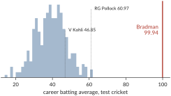
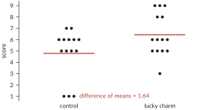
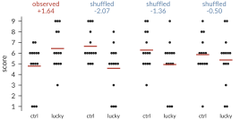
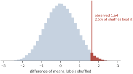
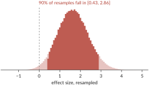
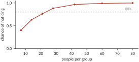
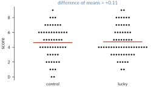
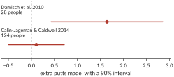

<!-- Intro note goes here: adaptation of the lecture (link), also available as a booklet. -->

<i>I recently took the time to turn an old <a href="https://www.alexalemi.com/talks/intro-to-statistics.html">lecture</a> of mine into a <a href="assets/shuffling-booklet.pdf">booklet</a>. This is that same story rendered as a blog post.</i>

Most published research findings are false.<sup><a href="#ioannidis">xxa-ioannidis</a></sup> Psychology and medicine are having a replication crisis.

<aside> <sup id="ioannidis">xxa-ioannidis</sup>
Ioannidis, John P. A. 2005. <a href="https://doi.org/10.1371/journal.pmed.0020124">"Why Most Published Research Findings Are False."</a> <em>PLoS Medicine</em> 2 (8): e124.
</aside>

I blame statistics. Or rather, I blame the classic teaching of statistics, which presents the field as an archaic and confusing set of rules that must be memorized, incantations that must be recited in the precise order prescribed by the textbook. This leads to no one understanding statistics at all, and everyone continually messing it up.

Statistics isn't confusing. The core ideas are *simple*. The central idea of statistics is that *a number is meaningless without context*. In order to make sense of measurements, we need to have something to compare them against.

<figure id="rats" class="right" style="width: 42%">
  <center>
  
  <figcaption>
  Figure xxf-rats. Watson and Hunter, 1906, redrawn from their Chart 5. The thin line averages 8 control rats fed bread and skimmed milk; the thick one averages 14 fed porridge, oatmeal cooked in milk and water. All began at two and a half months. Each arrow is a death. Porridge kills rats.
  </figcaption>
  </center>
</figure>

If you're lucky, you're studying a phenomenon with such a large effect that fancy math is not necessary to make its point. Figure xxf-rats is a reproduction of a plot from Watson and Hunter's 1906 feeding experiments. In fact, this paper contributed to the discovery of vitamins. The two lines show the trajectories of the average weight of rats fed two different diets. The thick line represents rats fed only porridge. The thin line represents rats fed bread and skimmed milk. Each arrow represents a death. You don't need math to tell you that the two results are different. If you feed rats porridge, they die. If you feed them bread and milk, they don't.

This chart is making an *argument* by means of *comparison*. Two similar groups behaved very differently; surely the difference is important. The results are convincing because the only measurement apparatus you need is your eye. You can *see* the difference in the two results.

Unfortunately, or perhaps fortunately for the rats, not all interventions have so large an effect as a complete lack of vitamins. When effects are more subtle, we need more elaborate tools to evaluate them, hence *statistics*.

## The Nature of Statistical Argument

<figure id="bradman-portrait" class="right" style="width: 36%">
  <center>
  
  <figcaption>
  Figure xxf-portrait. Sir Donald Bradman in 1932, with a bat carrying his own signature. Photograph by Sam Hood, State Library of New South Wales.
  </figcaption>
  </center>
</figure>

Let's start with a caricature of what a statistical argument even is, and with this fellow. Sir Donald Bradman was an Australian cricketer active in the twenties and thirties, and I'm going to argue for the hypothesis that *Donald Bradman was an alien*.

How would I make such an argument? The first thing I could try is to just tell you. Why was Donald Bradman an alien? Because *I say so*. This is obviously not much of an argument, but depending on what you know about me, and about cricket, you might still find it a little convincing. You shouldn't, or at least not very. Argument from authority is one of the lowest forms of argument, and you shouldn't give it much weight.

Here's another thing I could say: *"a one-sample $t$-test allows me to reject the null hypothesis that he wasn't an alien at the $p = 0.05$ level"*. Is that convincing? I'd like to point out that, unless you have some context, this is also an argument from authority. If you don't know what those words mean, if you don't know how to do that yourself, if you don't know what has to be true for that sentence to mean anything, then it's little more than "because I said so" with bigger words. And I think that's the sad state of affairs we're in: papers are filled with "evidence" readers can't check.

So let's try to do better. As scientists we like numbers, so here's one: *99.94*. Why was Donald Bradman an alien? Because *99.94*. Now, a number by itself shouldn't mean anything to you. Minimally you need some context, some units, some description of the procedure that produced it. So: *99.94 runs per inning*, his career average in test cricket. That's a measurement, but unless you know something about cricket you still don't know if that's a good number or a bad one.

Where can that context come from? The natural next step is to compare it to things *in kind*. Virat Kohli, one of the great modern batsmen, averaged 46.85 runs per inning over his career. So now we have the same measurement applied to two different cricketers, and we can see that Bradman's number is bigger. This is real evidence that Bradman was better than Kohli, but it's an epsilon amount of evidence that he was an alien. We could add Steve Smith at 56.00, and now we have two epsilons.

Let's keep going and look at all of them. Take every cricketer who has scored at least 2,000 runs in test cricket, all 348 of them, and plot the distribution of their career averages. Now we have what I think is a reasonable stand-in population for Donald Bradman: cricketers who have played a while. We can put Bradman on the same axis, as a single line, and see where he lands.

<figure id="bradman">
  <center>
  
  <figcaption>
  Figure xxf-bradman. Career test batting averages for every cricketer with at least 2,000 runs, and Bradman. The best of the rest is RG Pollock at 60.97; the median is 39.22.
  </figcaption>
  </center>
</figure>

Notice that everyone else is in a lump around 40 runs per inning. The very best of them get up into the low sixties. Then there's a lot of empty space, and then there's Bradman. If you want a number, he's 7.2 standard deviations above the mean of everyone else, but I don't think you need the number. Your eye should be telling you that there is just no way that line came out of that pile.

I want to pause on this comparison, because I think it really is the fundamental nature of statistical argument. We made a single measurement in the world. We put it in the context of a population that we could convince our opponent was a reasonable stand-in, and then we asked whether it was credible that our measurement was a draw from that population. That's it. Every statistical argument is an argument from incredulity: *"oh yeah, how do you explain this?"*

Now, I wanted this argument to be a bit silly, and I want to be honest about why it's silly, because the same silliness shows up in real papers. The hypothesis I was interested in was that *Donald Bradman was an alien*. What I actually showed you was that his career average is not a plausible draw from the distribution of long-run cricketers' career averages. Those are not the same claim. There are a lot of steps missing between them (several involving spaceships). I'd argue it does lend *some* credence to the original hypothesis, in the sense that if he's that unlike his peers then he's *superhuman*, and maybe we should entertain that he's *extraterrestrial*. But you should see the leap: he could simply be *exceptional*.

You'll often see the same kind of fantastical leap when you read a real paper. A paper is usually trying to convince you of something broad, like "my optimizer is better than yours" or "superstition improves performance," and what it actually has is some fairly narrow data. A lot gets left implied, and the strength of the argument depends on how well the narrow thing supports the broad thing.

## The Experiment

A little while ago there was a run of articles saying that lucky charms work. Athletes have their superstitions, and the claim was that studies had shown these actually improve performance. Most of those articles trace back to a single paper, Damisch, Stoberock and Mussweiler's *Keep your fingers crossed! How superstition improves performance*.<sup><a href="#damisch">xxa-damisch</a></sup> At a high level, the paper is trying to convince you that if you believe a thing will help you, and you use it, you'll perform better.

<aside> <sup id="damisch">xxa-damisch</sup>
Damisch, Lysann, Barbara Stoberock, and Thomas Mussweiler. 2010. <a href="https://doi.org/10.1177/0956797610372631">"Keep Your Fingers Crossed! How Superstition Improves Performance."</a> <em>Psychological Science</em> 21 (7): 1014–20.
</aside>

The paper has three experiments. Let's look at the first one. They recruited twenty-eight university students, split them into two groups, and put down a little putting green. One group was handed a golf ball and told "here is your ball, so far it has turned out to be a lucky ball." The other group was handed a ball and told "this is the ball everyone has used so far." Then everyone tried to sink ten putts, and the experimenters counted how many went in. Notice how much of a gap there is between what was actually done, handing some undergraduates a golf ball and telling them it's lucky, and the top-line claim that *superstition improves performance in sport*.

<figure id="observed">
  <center>
  
  <figcaption>
  Figure xxf-observed. The experiment. Each dot is one student. The red bars are the group means: 4.79 putts for the control group and 6.43 for the lucky group.
  </figcaption>
  </center>
</figure>

<aside> <sup id="reconstructed">xxa-reconstructed</sup>
The paper doesn't share its data, but it gives enough summary statistics that I was able to use a constrained optimization to find a data set consistent with them. So we're going to pretend this is the data. It reproduces the reported means and $t$ to two figures.
</aside>

The lucky group averaged 6.43 putts and the control group averaged 4.79, a difference of 1.64.<sup><a href="#reconstructed">xxa-reconstructed</a></sup> That difference of means is going to be our *statistic*: a single number we compute from the whole data set, chosen because it's the number our claim is about.

So do lucky charms work? Just looking at the data by eye, the claim doesn't seem absurd. Three people in the lucky group got nines, and nobody in the control group did. But of course there are lots of skeptical people in the world, and the skeptic is going to say: "No, that's not what's going on. People sink putts by different amounts all the time. It's random. You shouldn't take this as evidence that luck matters." And honestly, looking at the picture, they're not being unreasonable. We need to do better than pointing at it.

## The Skeptic

So let's write down what the skeptic believes. Our hypothesis is that luck matters. The skeptic's hypothesis, the null hypothesis, is:

<center><em>Being told the ball is lucky makes no difference at all.</em></center>

It's worth being careful about what this says. It doesn't say the two groups will come out equal. It says something much stronger: the *label* is irrelevant. Each student would have sunk exactly the putts they sank no matter which group we'd put them in. As far as the skeptic is concerned, the "lucky" and "control" tags are just decoration.

And that is a very useful thing for the skeptic to have committed to, because it tells us what else could have happened. If the tags are decoration, then the fourteen students we happened to call lucky could just as well have been any other fourteen of the twenty-eight. The scores were what they were. The only random thing was which fourteen got which tag.

## Godlike Powers

Here's what we need to do. We have one number, our computed statistic, the difference in the means for the two groups: 1.64. To make our argument from incredulity we need to replace that one number with a whole population of numbers, one that the skeptic has to admit is representative of a world where *they're* right, and then see whether our number fits in it. There are a few ways to build such a population, and they differ mostly in what kind of godlike powers you have available.

Let's start with the most convincing thing you could possibly do. If you were God, if you had intimate control over the entire universe, you could reach in and make it so that the skeptic *is right* and luck has no effect on putting. Then you could rerun that Tuesday afternoon. Reset the clock and run the same experiment a hundred thousand times in a world where you've mandated that luck doesn't matter, and each time compute the difference of means. The skeptic would have to agree that the resulting distribution is what they should expect, and then we could look at where our 1.64 falls in it. This would be perfect. Unfortunately, none of us are gods.

So let's talk about alternatives. The closest thing our forebears had to godlike powers, a hundred years ago, was the ability to do integrals on paper, and that's what most of classical statistics is built on. The idea is to replace the real world, complications and all, with a theoretical one: something simple enough that you can manipulate the formulas, but that you can still convince the skeptic applies. Then you work out, on paper, what the consequences would be in a world where luck had no effect.

<aside> <sup id="assumptions">xxa-assumptions</sup>
That's a lot of steps and a lot of assumptions, and I'm skipping some. To be fair to the ancients, a great deal of careful work has gone into working out how safe those assumptions are, but it's context an outsider usually isn't privy to, and none of it is something you can check by eye.
</aside>

<aside> <sup id="gosset">xxa-gosset</sup>
William Sealy Gosset worked out the $t$-distribution while working on brewing at Guinness. Guinness didn't let its staff publish, so he wrote as "Student", hence Student's $t$-test.
</aside>

Here's roughly how that goes for a $t$-test. You don't need to follow this; that it's hard to follow is the point. I don't know how people sink putts, but I do know how to do Gaussian integrals, so I'm going to assume that the number of putts each student sinks is normally distributed with some mean and standard deviation. That's step one. Step two: if I take fourteen draws from a normal in each of two groups and compute the difference of the means, I can work out how that difference is distributed. It's also normally distributed, because normals are nice that way. Unfortunately, the answer depends on the true standard deviation, which I don't know. So, step three: I decide to use the standard deviation I *observed* in the data instead, and now I have to ask how *that* quantity is distributed. I do a bunch of math and get a formula, and it's important enough that it gets a name: the chi-squared distribution. Step four: I look at the difference of means divided by a pooled standard deviation, do some more math, and discover that this particular combination has a distribution that doesn't depend on anything I don't know. It only depends on how many observations I made. At that point I declare victory. That's the $t$-distribution.<sup><a href="#assumptions">xxa-assumptions</a></sup> <sup><a href="#gosset">xxa-gosset</a></sup>

It works, and it's what the paper does. They report $t(26) = 2.14$ and $p < 0.05$; a one-sided $p$ works out to about 0.017. And I'd argue that unless you're a statistician with a lot of practice, that sentence is the "because I said so" argument again, just with more jargon.

These days we have a different set of godlike powers. We can write a `for` loop. A `for` loop lets you create millions of fake little worlds and look at them, and that's an ability the ancients simply didn't have. So that's what we're going to do next.

## Shuffling

Remember what the skeptic believes: the lucky tags don't matter. Well, if the tags don't matter, then it shouldn't matter to the skeptic if I go into the computer and shuffle them around. Take the twenty-eight scores, deal out fourteen "lucky" tags and fourteen "control" tags at random, and compute the difference of means again. As far as the skeptic is concerned, that's just as valid a measurement as the one we actually made. It would take a very special sort of skeptic to object, since all we did was change the one thing they told us they don't care about.

<figure id="shuffles">
  <center>
  
  <figcaption>
  Figure xxf-shuffles. The real experiment, and three re-deals of the same twenty-eight scores. Under the null hypothesis, all four are the same kind of thing.
  </figcaption>
  </center>
</figure>

<aside> <sup id="enumerate">xxa-enumerate</sup>
There are only 40,116,600 distinct ways to deal twenty-eight scores into two groups of fourteen, so we could have enumerated them all. Shuffling a couple hundred thousand times is easier and agrees to three decimals.
</aside>

<aside> <sup id="byhand">xxa-byhand</sup>
Do a few of these yourself before you read on. Twenty-eight index cards, one score on each: shuffle, deal into two piles of fourteen, add up each pile and subtract. Three or four deals is plenty. Get a feel for the process.
</aside>

Sometimes when you do this, the lucky group comes out ahead and sometimes it comes out behind, because, as the skeptic said, random things happen. But now we can do it 200,000 times<sup><a href="#enumerate">xxa-enumerate</a></sup> and build up an entire population of differences, and that population is exactly what the skeptic has to believe the world looks like.<sup><a href="#byhand">xxa-byhand</a></sup> This is what you get:

<figure id="null">
  <center>
  
  <figcaption>
  Figure xxf-null. Differences of means from 200,000 re-deals. This is the skeptic's world: everything that could have happened if the tag does nothing. Our observation is out at the edge.
  </figcaption>
  </center>
</figure>

Only 2.5% of the time do you observe a difference as large as the one we saw. It *strains* credulity to say that what we observed was simply random, but it's entirely *possible*. It's not nearly as convincing as the argument that Donald Bradman was an alien, but you have to admit it was unlikely.

Notice that this picture is the entire argument. There are no hidden pieces. You can understand all of the steps and *feel* the strength (or lack thereof) of the argument. We didn't assume the scores were normal, we didn't look anything up in a table, we didn't need $n > 30$ or equal variances or any of the other conditions that get recited and never checked. We took the skeptic's belief, worked out what it implied, and drew it. The whole thing fits on one slide, and I'd argue it can also fit in your head all at once.

## $p$-values

Now we can *quantify* how strange our observation is. In 200,000 shuffles, how often did the shuffled difference come out as large as the 1.64 we actually saw?

$$ p = \frac{\#\{\text{shuffles with difference} \geq 1.64\}}{\#\,\text{shuffles}} = 0.025 $$

<aside> <sup id="zero">xxa-zero</sup>
Count the real experiment as one of the shuffles, since it is one, and add one to the numerator and the denominator. A $p$-value of exactly zero is never honest.
</aside>

<aside> <sup id="custom">xxa-custom</sup>
The usual custom is to reject the null hypothesis if $p < 0.05$, i.e. if you observe something that would occur by chance only one time in twenty.
</aside>

That's a $p$-value.<sup><a href="#zero">xxa-zero</a></sup> It's a measure of how rare your observation is with respect to the population you offered the skeptic, and that's all it is. Here it says that chance beats us about one time in forty. It's rare, but not impossible.<sup><a href="#custom">xxa-custom</a></sup>

In code the whole thing is a few lines, and it's the same few lines no matter what statistic you choose.<sup><a href="#scipy">xxa-scipy</a></sup>

<aside> <sup id="scipy">xxa-scipy</sup>
See also <a href="https://docs.scipy.org/doc/scipy/reference/generated/scipy.stats.permutation_test.html"><code>scipy.stats.permutation_test</code></a>, which does exactly this.
</aside>

<!-- The code block runs the full column width, so drop below the floated
     sidenote above rather than running underneath it. -->
<div style="clear: right"></div>

```python
data = collect_data()
observed = statistic(data)
resampled = [statistic(permute(data)) for _ in range(N)]

p = (resampled >= observed).mean()      # or <=, or both
if p < threshold:
    reject_null()
```

That last part is worth dwelling on. In the analytic approach we were forced into one particular combination, the difference of means divided by a pooled standard deviation, because that was the combination whose distribution we could work out. Once we're shuffling we have a tremendous amount of freedom. We could look at the difference of medians, or the ratio of the means, or the standard deviations, or whatever we darn well please, and make the same argument from incredulity about it. In fact every named test you've heard of is this same process, played out once under a particular set of assumptions for a particular statistic, and named after whoever did the integrals.

It's not a completely free lunch. Permutation tests have a couple of downsides. The first is that the analytic argument needed nothing from the real world except the sample size. The permutation argument is explicitly downstream of the particular sample we took. If the Tuesday afternoon we ran the experiment was a weird day, shuffling inherits that weirdness in a way the $t$-test partly doesn't. That's a real trade. But notice which assumption is easier to defend to a skeptic: "you may shuffle tags you've said are meaningless," or "the number of putts out of ten is normally distributed."

The second came up as a question when I gave this as a lecture, and it's a good one. It isn't enough that your shuffle be consistent with the skeptic's belief. It also has to be inconsistent with yours. If luck really does matter, then shuffling the lucky tags destroys that effect, and that's exactly why the shuffled differences come out centered on zero. If you'd invented some resampling that preserved your effect, the resulting population wouldn't tell you anything at all.

## A Quiz

Here is where almost everybody goes wrong, including a lot of people who teach this. We observed $p = 0.025$. True or false?

1. You have absolutely disproved the null hypothesis.
2. There is a 0.025 probability that the null hypothesis is true.
3. You have absolutely proved that lucky charms work.
4. You can deduce the probability that lucky charms work.
5. You have a reliable finding, in the sense that if you repeated the experiment many times you'd get a significant result about 97% of the time.

<aside> <sup id="cohen">xxa-cohen</sup>
Cohen, Jacob. 1994. <a href="https://doi.org/10.1037/0003-066X.49.12.997">"The Earth Is Round (p &lt; .05)."</a> <em>American Psychologist</em> 49 (12): 997–1003.
</aside>

Every one of these is false.<sup><a href="#cohen">xxa-cohen</a></sup> Explaining why, to your own satisfaction, is left as an exercise for the reader, below. But let's at least look at the logic.

The following argument is completely valid. It's *modus tollens*:

> If the null hypothesis is true, $X$ is impossible.<br>
> We saw $X$.<br>
> $\therefore$ the null hypothesis is false.

What we're actually relying on is a relaxation of it, and the relaxation is not valid:

> **Wrong.** If the null hypothesis is true, $X$ is unlikely.<br>
> We saw $X$.<br>
> $\therefore$ the null hypothesis is unlikely.

To see that it isn't, keep the form and change the words:

> **Wrong.** If a person is American, they're unlikely to be a member of Congress.<br>
> Bob is a member of Congress.<br>
> $\therefore$ Bob is not American.

<aside> <sup id="bayes">xxa-bayes</sup>
If you already know Bayes' rule, here is the same complaint as an equation. Write $H_0$ for the skeptic's world and $H_1$ for the one where the charm works. In odds form,
$$ \frac{P(H_1 \mid D)}{P(H_0 \mid D)} = \frac{P(H_1)}{P(H_0)} \cdot \frac{P(D \mid H_1)}{P(D \mid H_0)} $$
The left side is what you wanted. On the right are your prior odds and the likelihood ratio, and you have to supply both.
Your $p$-value is neither. The nearest term is $P(D \mid H_0)$, and even that isn't it: $p$ is the chance of the observed difference <em>or anything more extreme</em>, a tail area rather than the probability of what you actually saw. Nothing you computed says a word about $P(D \mid H_1)$. Arguing from incredulity is assuming that the prior odds are near even and that the alternative predicts this data far better than the null does; where those assumptions fail, so does the argument.
</aside>

So why does the argument from incredulity carry any weight at all? The thing you actually want to know is the probability that the null hypothesis is true given the data. The thing you computed is the probability of seeing data like yours given that the null hypothesis is true. These are not the same thing, and it really is as simple as that. They are *related*, though. If you write out Bayes' rule, the thing you computed shows up as one of the terms, right alongside your prior odds and the term everyone forgets, how likely the data would have been under the alternative. The argument from incredulity is really an assumption that those other terms don't matter much, and most of the ways this goes wrong are cases where they do.<sup><a href="#bayes">xxa-bayes</a></sup>

So what have we actually established? Only this: if the tag doesn't matter, data like ours turns up about one time in forty. That's a real thing to have established. It's also less than we'd like.

## Effect Sizes and the Bootstrap

Not all questions are binary, and honestly it's a little silly to only ask whether luck matters. What we'd usually rather know is how much it matters, so we need a way to talk about *magnitudes*.

Let's start with something simpler than the effect. Just look at the control group. Their mean was 4.79, but that was one experiment and one number, and I might wonder how much I should trust it. Is the data consistent with college students sinking nine out of ten on average? Five out of ten? Some way to say what range of means the data supports would be useful.

The textbook answer is the *standard error of the mean*: take the standard deviation, divide by the square root of $n$, and call that your uncertainty. Where does that come from? It's the same analytic argument again. Assume the data is normal and work out the math. It isn't wrong, but it rests on assumptions, and again it's not something you can check by eye.

<aside> <sup id="empirical">xxa-empirical</sup>
We're still making a modeling assumption here, but a fairly innocuous one. Rather than saying the data is normal, we're saying we can use the empirical distribution of the data itself as the model. We aren't saying anything about its shape or its tails.
</aside>

<aside> <sup id="fourteen">xxa-fourteen</sup>
Why draw exactly fourteen? Because the width of the answer should reflect the fact that we measured fourteen people. Draw 140 and you'd get a much tighter interval, for an experiment you didn't run.
</aside>

The bootstrap is the `for`-loop version. The logic goes like this. I don't know what distribution governs how well college students putt. It might be bimodal, it might be anything. But I do think these fourteen measurements are all fair samples from it, and none of them is special. So it isn't unreasonable to treat each one as equally likely.<sup><a href="#empirical">xxa-empirical</a></sup> Throw all fourteen numbers into a hat and draw fourteen back out, with replacement, so that any of them can show up more than once.<sup><a href="#fourteen">xxa-fourteen</a></sup> That gives you a new data set that's just as credible as the one you had. Compute its mean. Do it again. Again. Do it 200,000 times and you have a whole distribution of means that are consistent with your data. In this case, 90% of them fall between 3.86 and 5.64.

Now we can do the same thing for the effect. Resample *within* each group, keeping the tags this time, and compute the difference of means for each resample.

<figure id="bootstrap">
  <center>
  
  <figcaption>
  Figure xxf-bootstrap. The effect size under resampling. Ninety percent of the resamples land between 0.43 and 2.86 putts.
  </figcaption>
  </center>
</figure>

So we could tell the world that we're reasonably confident the lucky ball is worth somewhere between 0.43 and 2.86 extra putts. Notice how wide that is. The charm might be worth half a putt or it might be worth three, and fourteen students per group just can't tell us which.

## Power

So far we've just been talking about what you can do with the data you've already collected. An underappreciated aspect of statistics is that, especially if you have access to a computer, you can plan before you collect the data at all.

Suppose luck really does matter, and it's worth about the 1.64 putts we saw. If you ran this experiment, would you notice? I don't mean is there an effect; assume there is. I mean, would an experiment of this size be able to see it? That's the *power* of the study. Given your plan to look at only so many students, there is a limit to the *resolution* you have for effects of different sizes. Very large effects don't need much data before they are obvious; subtle ones need a lot more. Invent a world where the effect is real, run the experiment in that world a few hundred times, and count how often you'd have rejected the null.

<figure id="power">
  <center>
  
  <figcaption>
  Figure xxf-power. Chance of detecting a 1.64 putt effect at $\alpha = 0.05$, against the number of students in each group.
  </figcaption>
  </center>
</figure>

<aside> <sup id="mde">xxa-mde</sup>
The same question backwards: what is the smallest effect this study could reliably catch? Held at 14 per group and $\alpha = 0.05$, the charm would have to be worth about 2.1 putts before you'd detect it 80% of the time. That's 1.3 times the effect the paper actually reported. Below that, a null result mostly tells you the study was small.
</aside>

With 14 students per group the answer is about 0.63. In other words, even when the charm really works, an experiment this size misses it more than a third of the time. To get to the usual target of 80%, you'd want something closer to twenty-five per group.<sup><a href="#mde">xxa-mde</a></sup>

<aside> <sup id="reinhart">xxa-reinhart</sup>
Reinhart, Alex. 2015. <a href="https://www.statisticsdonewrong.com/"><em>Statistics Done Wrong: The Woefully Complete Guide</em></a>. No Starch Press. The Cohen story is Cohen (1962) and Sedlmeier and Cohen (1989).
</aside>

Power is entirely essential and entirely ignored. Fewer than 3% of articles in *Science* and *Nature* calculate power before starting the study.<sup><a href="#reinhart">xxa-reinhart</a></sup> In 1962, Jacob Cohen looked at the statistical power of studies published in the *Journal of Abnormal and Social Psychology* and found that the average study had a power of 0.48 for detecting medium-sized effects. His paper was cited hundreds of times and many similar reviews followed, all calling for larger samples. Then, in 1989, a review showed that in the decades since, the average study's power had actually *decreased*.

## It Didn't Replicate

In 2014, Calin-Jageman and Caldwell ran the lucky ball experiment again,<sup><a href="#calinjageman">xxa-calinjageman</a></sup> this time with 124 students instead of 28, and put their data online. Here's what they found.

<aside> <sup id="calinjageman">xxa-calinjageman</sup>
Calin-Jageman, Robert J., and Tracy L. Caldwell. 2014. <a href="https://doi.org/10.1027/1864-9335/a000190">"Replication of the Superstition and Performance Study by Damisch, Stoberock, and Mussweiler (2010)."</a> <em>Social Psychology</em> 45 (3): 239–45. Data <a href="https://osf.io/53es8">on the OSF</a>.
</aside>

<figure id="replication-data">
  <center>
  
  <figcaption>
  Figure xxf-repdata. The replication's own scores, drawn the way we drew the original. The red bars are the group means.
  </figcaption>
  </center>
</figure>

<figure id="replication">
  <center>
  
  <figcaption>
  Figure xxf-replication. The original and the replication. Four times the students, and the effect is gone.
  </figcaption>
  </center>
</figure>

The lucky group beat the control group by 0.11 putts, which works out to a $p$-value of 0.40. Shuffle the tags and you beat that four times out of ten. There's nothing there.

<aside> <sup id="repinterval">xxa-repinterval</sup>
Bootstrapping the replication's data the same way gives a 90% interval from −0.49 to 0.71 extra putts, which includes zero.
</aside>

<aside> <sup id="crisis">xxa-crisis</sup>
This is, I think, most of the replication crisis. Not fraud and not incompetence, but underpowered studies, and the ones that got published are the ones that got lucky.
</aside>

It's worth being clear about what happened here, because it isn't what people usually assume. The original study wasn't fraudulent and it wasn't incompetent. It was honestly run and correctly analyzed and correctly reported, and its $p$-value was under 0.05. It was also, as we just worked out, a study with about a 60% chance of detecting its own effect. That means that whenever a study like that does clear the bar, it mostly clears it by getting a lucky draw, and a lucky draw is by definition one that overstates the effect. Small studies that reach significance have usually overestimated the effect they're reporting, because overestimating it is how small studies reach significance. The original study reported an effect of 1.64 extra putts. The replication found something indistinguishable from zero.<sup><a href="#repinterval">xxa-repinterval</a></sup> <sup><a href="#crisis">xxa-crisis</a></sup>

## Designing Your Study

Before you collect anything:

1. Write the hypothesis down.
2. Write the null down: what the skeptic says. Usually it's "the thing you varied is irrelevant, and the tags could be shuffled."
3. Pick the statistic.
4. Guess how big the effect could plausibly be.
5. Simulate. How many people before you'd notice an effect that size? If that's more people than you can get, redesign the study now.
6. Randomize the assignment for real. The whole argument rests on the shuffle being an honest description of what you actually did.

Afterward:

1. Compute the *observed* statistic in your actual data.
2. Shuffle ten thousand times and recompute the statistic in those imagined data sets.
3. Count how often the simulated statistics exceed the observed one. That's your $p$-value.
4. Bootstrap, to say how big the effect is and how sure you are.
5. Report the bootstrap interval, not just the $p$-value.
6. Report what you did, including what didn't work.

So, what are you waiting for?

## Further Reading

Julian Simon's [*Resampling: The New Statistics*](https://www.resample.com/intro-text-online/) is the book that argues this is how statistics should have been taught all along, and Shasha and Wilson's [*Statistics is Easy!*](https://doi.org/10.2200/S00295ED1V01Y201009MAS008) is a short and practical version of the same idea. Alex Reinhart's [*Statistics Done Wrong*](https://www.statisticsdonewrong.com/) is a tour of everything that goes wrong, and is where the power numbers above come from. Jacob Cohen's [*The Earth is Round (p < .05)*](https://doi.org/10.1037/0003-066X.49.12.997) is a six-page paper about $p$-values. And Freedman, Pisani and Purves' *Statistics* is the standard textbook that takes all of this seriously.

The lecture this post grew out of is [on YouTube](https://www.youtube.com/watch?v=7gIZXB1lY7Y), and covers most of the same ground, though it runs out of time before power and the replication. And an earlier post of mine [on leap-day births](https://blog.alexalemi.com/ob/nbs/leap-day.html) uses exactly these two tools, a permutation test and a bootstrap, on fifteen years of Social Security birth records, to check a newspaper's claim that leaplings arrive at a rate of one in 1,461. They don't.

## Exercises

These are meant to help develop better intuitions and to explore a few ideas we didn't have room for. Collaboration is strongly encouraged. Try to have fun with them. Exercises marked † are more involved, and ones marked ‡ are the most involved.

1. Do the shuffle by hand. Twenty-eight index cards, one score on each. Shuffle, deal into two piles of fourteen, subtract the means. Do it ten times and plot your ten numbers. How many of them beat 1.64?

2. Calin-Jageman and Caldwell's replication is summarized below and available in full [on the OSF](https://osf.io/53es8). Test the hypothesis that lucky charms work using this data and a permutation test. You should be able to reproduce the 0.11 and the $p = 0.40$ quoted above.

   <table>
   <tr><th>hits</th><th>0</th><th>1</th><th>2</th><th>3</th><th>4</th><th>5</th><th>6</th><th>7</th><th>8</th><th>9</th><th>10</th><th>total</th></tr>
   <tr><td>control</td><td>2</td><td>3</td><td>6</td><td>5</td><td>11</td><td>8</td><td>12</td><td>7</td><td>3</td><td>1</td><td>0</td><td>58</td></tr>
   <tr><td>lucky</td><td>0</td><td>2</td><td>5</td><td>10</td><td>20</td><td>8</td><td>7</td><td>6</td><td>6</td><td>2</td><td>0</td><td>66</td></tr>
   </table>

3. We used the difference of means. Redo the permutation test with the difference of medians. Does the conclusion change? Which statistic would you have wanted to commit to in advance, and why isn't "whichever gave the smaller $p$" an acceptable answer?

4. Our test was one-sided; we counted only the shuffles where the lucky group did better. Now count the shuffles where either group beat the other by 1.64 or more, and you should get about 0.050. Which was the right question to have asked, and when did you have to decide?

5. † Get a feel for the accuracy of bootstrap confidence intervals. Flip a coin ten times and count the heads, then use the bootstrap to estimate an interval for the fairness of the coin. Now, in the computer, simulate ten flips of a fair coin, ten thousand times over, and for each of those compute a bootstrap interval. How often is the true probability of 0.5 inside the interval? Does this depend on the bias of the coin, or on the number of flips?

6. † Repeat the analysis in [the original M&M blog post](https://blogs.sas.com/content/iml/2017/02/20/proportion-of-colors-mandms.html), but using simulation. The author ate and recorded the colors of 712 M&Ms, and the hypothesis to check is that these came from a different distribution than the one published in 2008. How would you check this using simulation? How convinced are you?

7. † Repeat the analysis in the previous question, but this time for [my M&M data](https://docs.google.com/spreadsheets/d/1pnyWVv7m60tDSlE0a5PK5Xasq1rt74A9BZc1_7h3MWM/edit): 11,211 M&Ms, 38 bags, by factory and type. In particular, the blog post claims that Mars told its author that the two plants use the color proportions below. Are these still accurate?

   <table>
   <tr><th></th><th>brown</th><th>red</th><th>yellow</th><th>green</th><th>orange</th><th>blue</th></tr>
   <tr><td>Cleveland</td><td>0.124</td><td>0.131</td><td>0.135</td><td>0.198</td><td>0.205</td><td>0.207</td></tr>
   <tr><td>Hackettstown</td><td>0.125</td><td>0.125</td><td>0.125</td><td>0.125</td><td>0.25</td><td>0.25</td></tr>
   </table>

8. † Same data: are the two factories even different from each other? State the null, pick a statistic, and shuffle the factory labels.

9. ‡ Choose your own hypothesis to investigate using the M&M data, and formulate a statistical argument for it.

10. ‡ Perform your own statistical analysis to test a hypothesis you have. It could be a hypothesis in machine learning, like "gelu is better than relu," or it could be something you've wondered about, like "people named Fred make more money." Choose your hypothesis, design an experiment, work out how much data you'd need, collect it, and formulate a statistical argument. Then repeat that argument a different way, using an analytical method, or resampling, or Bayesian inference.
