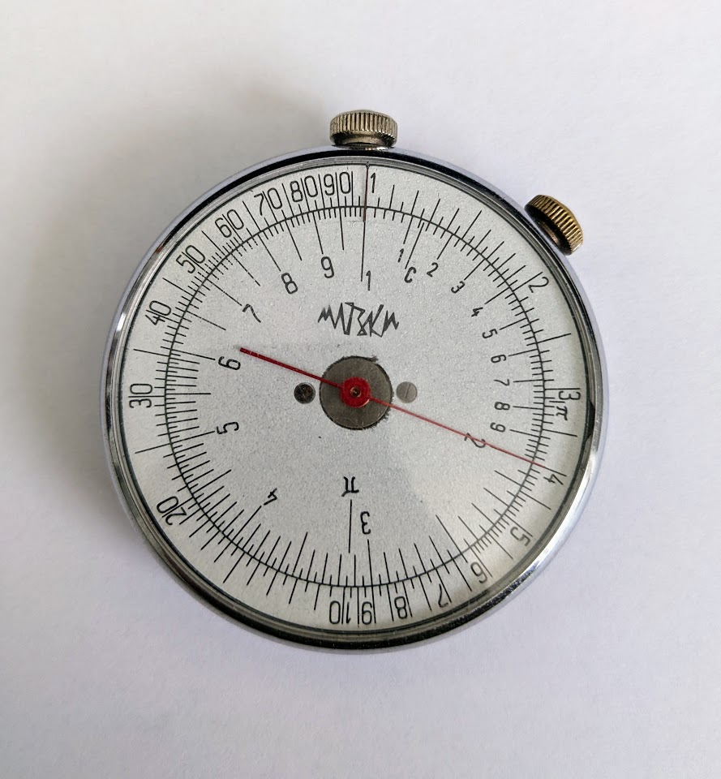

Sliderules rule.  I'm rather enamored with them.  

I've collected several over the years.  One of my favorite 
is my old <a href="https://collection.maas.museum/object/383283">Soviet KL-1</a>.

<figure id="#benford">
  

  
  <figcaption>
  Figure xxf-physical. This is a picture of one of my <a href="https://collection.maas.museum/object/383283">Soviet KL-1 circular slide rules</a>, which previously featured in <a href="benfords.html">my post about Benford's law</a>.
  </figcaption>
  

</figure>

Unlike a pocket
calculator, it feels like using a sliderule helps you develop a better number
sense, rather than rob you of one. 
An elegant weapon for a more civilized age.

## Digital Sliderule

In order to ensure that I always have a sliderule at my disposal, I recently build a *digital* one, available at
<a href="https://sliderule.alexalemi.com">sliderule.alexalemi.com</a>.

<figure id="#sliderule">
    

    
    

  <figcaption>
  Figure xxf-sliderule. The digital sliderule I made at <a href="https://sliderule.alexalemi.com">sliderule.alexalemi.com</a>.
  </figcaption>
  

</figure>

## Zine

If you're new to slide rules, in keeping with the tangible, physical theme, I made a <a href="https://en.wikipedia.org/wiki/Zine">Zine</a> that attempts to introduce how they work.  You can read it here:

<!--
 
 
 
 
 
 
 
 
-->

    

        
        

        

    

    

        Page 1 of 8
    

Or you can download a <a href="assets/sliderule-zine.pdf">PDF</a> copy that you can print and <a href="https://www.42ndstreet.org.uk/media/etdlxppk/zine-guide-colour.jpg">fold</a> yourself.

If you want to learn more, there is an old <a href="https://sliderulemuseum.com/Manuals/M220_AnEasyIntroductionToTheSlideRule_IsaacAsimov_1965.pdf">book by Isaac Asimov</a>,  or a great <a href="https://www.youtube.com/watch?v=oYQdKbQ-sgM">1957 Educational film</a>.

## Make your own

You can <a href="https://www.sliderulemuseum.com/REF/scales/MakeYourOwnSlideRule_ScientificAmerican_May2006.pdf">print your own</a> using instructions in an old <a href="https://www.physics.wisc.edu/ingersollmuseum/wp-content/uploads/sites/10/2020/04/scientificamerican0506-80-WhenSlideRulesRuled.pdf">Scientific American article</a>.

Or an innovated <a href="https://sliderulemuseum.com/SR_Scales.shtml#YingHum">circular slide rule</a> created by Ying Hum that can be printed and fit in an old CD jewel case.

Another option would be to 3D print your own. <a href="https://www.youtube.com/watch?v=qTd03m8rsfg">Alex Desilets created plans</a> for a series of 3D printed sliderules. 

<figure id="#printed-sliderule">
  

  
  <figcaption>
  Figure xxf-printed. A circular sliderule I 3d printed.
  </figcaption>
  

</figure>

