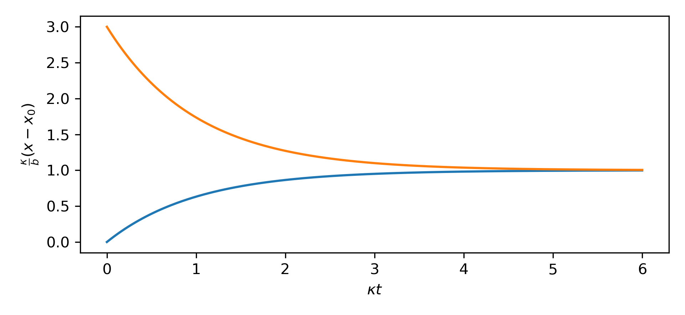

$ \newcommand{\coo}{\mathrm{CO_2}} $

We recently bought an [Airthings](https://www.airthings.com/en/view-plus) so I have been geeking out looking at plots of our air quality.

In general, we don't seem to have any issues with our indoor air, except when we use
the stovetop without the exhaust on it will spike our PM2.5 and in general we have
higher $\coo$ concentrations indoors.

There are four of us in the house, and since we homeschool and I work from
home, there is a lot of $\coo$ generation happening and I've tried to seal up our
house as well as I can to make it energy efficient.

This got me thinking about how to model the $\coo$ concentration in our house.

## The Model

Let's start with a basic model, we know that we have sources in the form of the
four humans in the house, and that we exchange air with the outside air which
is at something like $420 \textrm{ ppm}$.

This suggests a simple model of the form:

$$ \dot x = b - \kappa ( x - x_0 ) $$

Where we use $x$ to denote the concentration of $\coo$, $x_0$ for the outdoor
concentration of $420\textrm{ ppm}$, $b$ represents the constant source from
the humans in the house and $\kappa$ represents an exchange with the outside.  

Here we assume that the rate of change is proportional to the difference,
similar in spirit to [Fourier's
law](https://en.wikipedia.org/wiki/Thermal_conduction#Fourier's_law).  In terms
of our model, this is equivalent to assuming that within some time window, we
replace some fraction of the air in the house with fresh air from outside. To
break it down a bit more, imagine some amount of time $\Delta t$, the change in
the concentation of $\coo$ inside can be modelled as taking some fraction
$\kappa \Delta t$ of the total air inside and replacing it with fresh air, this
means we decrease the concentration by $\kappa x \Delta t$ and then increase it
by $\kappa x_0 \Delta t$, giving us the form we see above.

I find its easier to formulate a differential equation or physical model in
terms of unitful quantities, but then easier to solve them if we take the time
to non-dimensionalize (which we'll do below). 
Here our $x$ is in units of $\textrm{ppm}$ by volume, a
dimensionless measure of concentration.  We'll imagine our time variable taking
on the units of $\textrm{days}$ for convenience.  Then our source term $b$ has
units of $\text{ppm/day}$ and measures the increase in $\coo$ concentration the
four of us cause each day within the volume of our house. We could look up this
number and find $900 \textrm{ gCO$_2$/day}$ produced per person.<a
href="#co2perperson">1</a>
	
## Estimating Sources

<aside> 1 
	I originally found this number <a href="https://www.globe.gov/explore-science/scientists-blog/archived-posts/sciblog/2008/08/11/release-of-carbon-dioxide-by-individual-humans/comment-page-1/index.html#:~:text=For%20a%20year%2C%20our%20human,the%20carbon%20dioxide%20we%20exhale">here</a> on some goverment blog site which says that wikipedia had the figure and sourced it from a USDA study.  It no longer appears on wikipedia but appears on some <a href="https://www.carbon-dioxide-properties.com/aboutco2.aspx#:~:text=Typically%20the%20gas%20we%20exhale,of%20carbon%20dioxide%20per%20day">clones</a> which use <a href="https://faithscience.org/wp-content/uploads/2019/03/HANNA002.pdf">this article</a> as a reference which cites a USDA study without reference. Other sites include a 2.3 lb/day figure, i.e. <a href="https://www.nrdc.org/stories/do-we-exhale-carbon#:~:text=The%20average%20human%20exhales%20about,CO2%20as%20his%20sedentary%20brethren.)">here</a>.
</aside>

Instead of looking up the number, let's see if we can estimate it.  We release carbon dioxide because we respire, our body burns hydrocarbons that we eat to generate energy for our body.  Carbohydrates and sugars have an energy density of $4 \textrm{ kcal/g}$ which you can verify on the back of your favorite candy bar.  The basic chemistry of respiration (and photosynthesis) is the burning of these hydrocarbons:

$$ \mathrm{C}_n\mathrm{H}_{2n}\mathrm{O}_n + n \mathrm{O}_2 \to n\mathrm{CO}_2 + n \mathrm{H}_2\mathrm{O} + \textrm{energy}  $$

If we total up the atomic masses in this formula, we find that for every $30 \textrm{ grams}$ of carbohydrates we burn, we release $44 \textrm{ grams}$ of carbon dioxide. If we typically eat $2000 \textrm{ kcal/day}$, this works out to $730 \textrm{ g/day}$ of $\coo$ per person, a pretty good match to the numbers you'll find online.

What does this mean for the atmosphere in my house?  Well, we have a $2100 \textrm{ft}^2$ home with $8 \textrm{ ft}$ ceilings. This gives us:

$$ \frac{730 \textrm{ g/day}}{2100 \textrm{ ft}^2 \cdot 8 \textrm{ ft} \cdot 1.225 \textrm{ kg/m}^3} = 1300 \textrm{ ppm/day}$$

In terms of the mass fraction.  However, $\coo$ concentrations we read about in papers or measure on sensors are volumetric fractions.  Carbon dioxide has a molar mass of $44 \textrm{ g/mol}$ while natural air is $29 \textrm{ g/mol}$<a href="#airmole">2</a>, so to convert the mass fraction to a volume fraction we need to multiply by $44/29$.

<aside> 2 
	To zeroth order, Air is nitrogen at 28 g/mol, to next order its 3/4 nitrogen and 1/4 oxygen (at 32 g/mol) for a total of 29 g/mol.
</aside>

In the end, we estimate that each person in my house contributes $1900 \textrm{ ppm/day}$ of volumetric $\coo$ concentration.  Outdoor concentrations are $420 \textrm{ ppm}$ and my sensor turns yellow when the indoor concentration exceeds $800 \textrm{ ppm}$ and red above $1000 \textrm{ ppm}$.

## Estimating $\coo$ conductivity

We've estimated $b$, but what about $\kappa$, well, this is a measure of how quickly we exchange air in the house.  If we close the windows and have the AC occasionally run the fan, it seems like the indoor $\coo$ concentration will level out at about $1800 \textrm{ ppm}$.  Meanwhile, in our model, if we solve for the steady state:

$$ \dot x = 0 = b - \kappa ( x - x_0 ) \implies x = x_0 + \frac{b}{\kappa} $$

and put in our estimates of a steady state value of $1800 \textrm{ ppm}$ and
our estimate that for four humans we have $b = 4 \cdot 1800 \textrm{ ppm/day}$
we get an estimate of $\kappa = 5.5 \textrm{ /day}$.  Honestly, this feels low,
I know that most houses are supposed to have about 1 air change per hour,
though here we are discussing specifically $\coo$ but I would expect the rates
to be the same.  I might have to have a blower door test done to see how sealed
up our home is.  We live in an older home which I generally expect to be fairly
leaky, but we did some renovations recently and took care to try to seal up
potential leaks.  We may have sealed up the house too much and might have to
look into installing something like an [Energy Recovery
Ventilation](https://en.wikipedia.org/wiki/Heat_recovery_ventilation) system to
ensure we have fresh enough air.

Then again, we seem to be able to shed our PM2.5, VOCs and other polutants
rather quickly, so perhaps there is just an issue with our $\coo$ sensor
itself.  Regardless, now that we have a model we can go on to solve it.

## Non-dimensionalizing

I always find it useful to nondimensionalize differential equations when I'm
solving them.  This means reparameterizing the equation to be in terms of only nondimensional quantities.
In this case we'll form a dimensionless measure of the excess concentration, and use our $\kappa$ constant to
reparameterize in terms of some relevative time:

$$ \chi \equiv \frac{\kappa}{b} (x - x_0)  \implies \dot \chi \equiv \frac{\kappa}{b} \dot x $$
$$ \tau = \kappa t \implies dt = \kappa dt $$

After transforming we obtain:

$$ \frac{d\chi}{d\tau} = 1 - \chi $$

Which we can solve in typical physicist fashion:

$$ \begin{align}
	\frac{d\chi}{d\tau} &= 1 - \chi \\
	\frac{d\chi}{1 - \chi} &= d\tau \\
	\int_{\chi_0}^{\chi} \frac{d\chi}{1 - \chi} &= \int_0^\tau d\tau \\
	\log \frac{1 - \chi_0}{1 - \chi} &= \tau\\
	\frac{1 - \chi}{1 - \chi_0} &= e^{-\tau}\\
	\chi &= 1 + (\chi_0 - 1) e^{-\tau}
\end{align}
$$

To see that the behavior should be a simple exponential relaxation to the steady state.

<figure id="#relaxation" class="right">
  

  
  <figcaption>
  Figure 1. Two example evolutions of the $\coo$ given by the model.
  </figcaption>
  

</figure>

In this nondimensional form, it becomes clear that everything is dominated by
$\kappa$, if we wanted to either change the equilibrium value or get there
sooner, we need to adjust $\kappa$, or the air flow rate.  If we open a couple
windows and turn on the fans in the house, even with all four of us in here,
the $\coo$ concentration then settles down at something like $600 \textrm{
ppm}$ suggesting that the $\kappa$ is now something like $42 \text{ /day}$, and
that the $\coo$ takes about $2/(42 \textrm{ /day}) \approx 1 \textrm{ hour}$ to
fall.

## Would Plants help?

Could we better control our indoor $\coo$ concentration by having some
houseplants? While plants also respire like we do, they also photosynthesis,
using the sun's energy to run the chemical equation above backward, fixing
$\coo$ in the air into carbohydrates and sugars.

Unfortunately, as we saw above, what's really important for the chemistry is
essentially the weight of the products.  For every $30 \textrm{ grams}$ of
carbohydrates we burn we release $44 \textrm{ grams}$ of $\coo$ into the air,
plants go in reverse: for every $30 \textrm{ grams}$ of carbohydrates they
synthesize they consume $44 \textrm{ grams}$ of $\coo$ from the air.  This
means that if every person in our house is releasing $730 \textrm{ g/day}$ of
$\coo$, we would need $500 \textrm{ g/day}$ of sugars being synthesized to
offset each of us.  Unfortunately plants do not grow nearly that fast.  It
seems most plants grow a couple kilograms a year, let alone a day.  We are
unlightly to make a dent in our resting $\coo$ concentration indoors unless we
turned our house into a relative jungle.

## Impact on Earth

To put something like climate change into perspective, we just worked out that
a typical human releases something like $730 \textrm{ g/day}$ of $\coo$ just by
breathing.  Granted, this $\coo$ doesn't tend to increase $\coo$ atmospheric
concentrations because it came from carbon that very recently was in the
atmosphere itself (before being fixed by our food).  Our breathing is
essentially carbon neutral, but let's work out how much humanities collective breathing
compared with atmospheric $\coo$ concentrations.

As before, we just need to scale up this production by the 8 billion humans on
the planet and then divide by the total weight of the atmosphere, then correct
for the volumetic concetration rather than mass based one.

To estimate the weight of the atmosphere, we know that the $1 \textrm{ atm}$ of air pressure at the 
surface is caused by the weight of air above us, so the total mass of the atmosphere is roughly:

$$ \frac{1 \textrm{ atm} \cdot 4 \pi R^2}{g} \approx 5.2\times 10^{21} \textrm{ g} $$

So we can work out that the relative $\coo$ concentration from human breathing is:

$$ \frac{730 \textrm{ g/day}}{5.2 \times 10^{21} \textrm{ g}} \cdot 7\times 10^9 \cdot \frac{44}{29} \approx \frac{2}{3} \textrm{ ppm/year}, $$

<aside> 3 
	From the <a href="https://mlg.eng.cam.ac.uk/carl/words/carbon.html#:~:text=In%201960%2D1970%20the%20growth,about%202.47%20ppm%20per%20year.">Carl Edward Rasmussen</a>.
</aside>
about $0.6 \textrm{ ppm/year}$.  Again, human breathing is actually net neutral, but given the magnitude here, it becomes a bit easier to
imagine that human activities and burning of fossil fuels might be contributing $2.47 \pm 0.25 \textrm{ ppm/year}$ to the atmosphere.<a href="#coorate">3</a>.  If we could csomehow sequester all of the $\coo$ that all of the humans on the planet breathe out, that would only reduce the atmospheric growth rate of $\coo$ by 25%.
Humanity operates on a truly global scale and we now have very direct influences on the chemistry of the planet.

